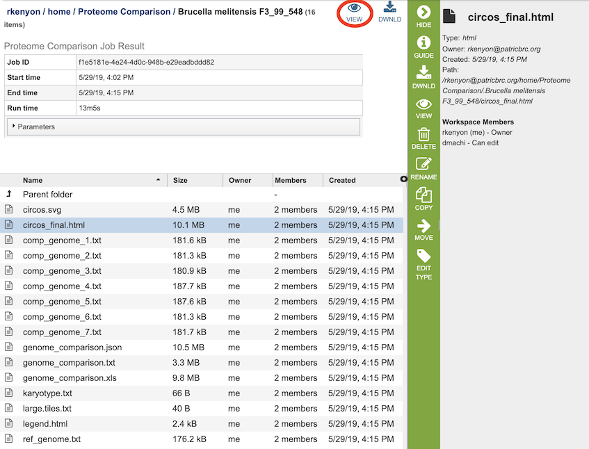

# Proteome Comparison Service

## Overview
The Proteome Comparison Service performs protein sequence-based genome comparison using bidirectional BLASTP. This service allows users to select up to eight genomes, either public or private, and compare them to a user-selected or supplied reference genome. The proteome comparison result is displayed as an interactive circular genome view and is downloadable as a print-quality image or tabular comparison results.

### See also
* [Proteome Comparison Service](https://patricbrc.org/app/SeqComparison)
* [Proteome Comparison Tutorial](https://docs.patricbrc.org//tutorial/proteome_comparison/proteome_comparison.html)

## Using the Proteome Comparison Service
The **Proteome Comparison** submenu option under the **Services** main menu (Protein Tools category) opens the Proteome Comparison input form (*shown below*). *Note: You must be logged into PATRIC to use this service.*

## Options
 

## Parameters

### Advanced parameters:

**Minimum % coverage:** Minimum percent sequence coverage of query and subject in blast. Use up or down arrows to change the value. The default value is 30%.

**BLAST E value:** Maximum BLAST E value. The default value is 1e-5.

**Minimum % Identity:** Minimum percent sequence identity of query and subject in BLAST. Use up or down arrows to change the value. The default value is 10%.

### Output Folder
The workspace folder where results will be placed.

### Output Name
Name used to uniquely identify results.

## Reference Genome Selection
Select a reference genome from the genome list or a FASTA file or a feature group. Only one reference is allowed.

### Select a genome
Type or select a genome name from the genome list.

### Or a FASTA file
Select or upload an external genome file in protein FASTA format.

### Or a feature group
Select a feature group from the workspace to show comparison of specific proteins instead of all proteins in a genome.

## Comparison Genomes Selection
Select up to total of 9 genomes from the genome list or FASTA files or a feature groups and use the plus buttons to place the genomes to the table .

### Select genome
Type or select a genome name from the genome list.

### And/or select FASTA file
Select or upload an external genome file in protein FASTA format.

### And/or select feature group
Select a feature group from the workspace.

## Buttons
**Reset:** Resets the input form to default values

**Submit:** Launches the proteome comparison job. Upon completion, the result is displayed as an interactive circular genome view and is downloadable as a print-quality image or tabular comparison results.

## Results

The Proteome Comparison Service generates several files that are deposited in the Private Workspace in the designated Output Folder. These include 

* **circos.svg** - a Scalable Vector Graphics (SVG) image showing the proteome comparison in a cicular view
* **circos_final.html** - a webpage displaying the SVG file.
* **comp_genome_X.txt** - 
* **genome_comparison.xls** - an Excel file containing the best BLAST hits for each compared genome to the reference genome.  The columns in the table are as follows (for each genome):
  * _contig - 
  * `_`gene - 
  * `_aa_length - 
  * `_patric_id - 
  * `_locus_tag - 
  * `_gene_name - 
  * `_plfam_id - 
  * `_pgfam_id - 
  * `_function - 
  * `_start - 
  * `_end - 
  * `_strand - 
  * `_hit - (comparison genomes only
* **genome_comparison.json** - 
* **genome_comparison.txt** - 
* **karyotype.txt** - 
* **large.tiles.txt** - 
* **legend.txt** - 
* **ref_genome.txt** - 

### Action buttons
After selecting one of the output files by clicking it, a set of options becomes available in the vertical green Action Bar on the right side of the table, listed below. To find out more about the different options for using these output files, see the [Variation Analysis Service Tutorial](https://docs.patricbrc.org//tutorial/variation_analysis_service/variation_analysis_service.html).

* **Hide/Show:** Toggles (hides) the right-hand side Details Pane.
* **Guide:** Link to the corresponding User Guide
* **Download:**  Downloads the selected item.
* **View:** Displays the content of the file, typically as plain text or rendered html, depending on filetype. Only available for html, txt, and tsv file types.
* **Delete:** Deletes the file.
* **Rename:** Allows renaming of the file.
* **Copy:** Copies the selected items to the clipboard.
* **Move:** Allows moving of the file to another folder.
* **Edit Type:** Allows changing of the type of the file in terms of how PATRIC interprets the content and uses it in other services or parts of the website.  Allowable types include unspecified, contigs, nwk, reads, differential expression input data, and differential expression input metadata.

More details are available in the [Action Buttons](../action_buttons.html) user guide.

## References
1. Li, H. (2014) Towards better understanding of artifacts in variant calling from high-coverage samples. Bioinformatics, btu356.
