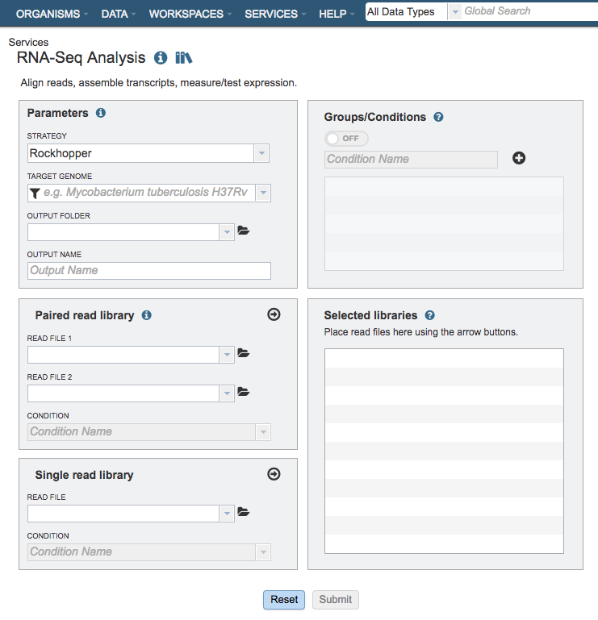
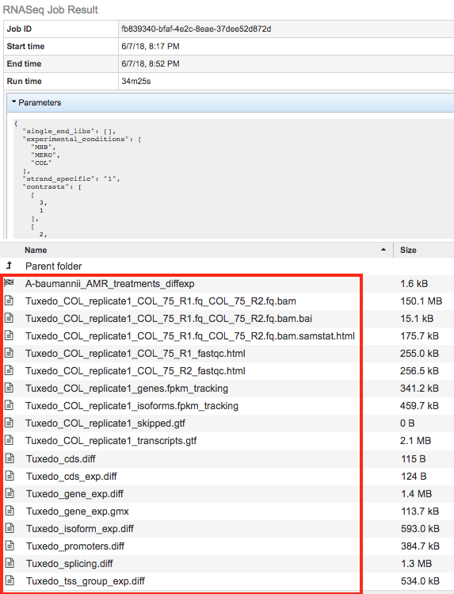

# RNA-Seq Analysis

## Overview
The RNA-Seq Analysis Service provides services for aligning, assembling, and testing differential expression on RNA-Seq data. The service provides three recipes for processing RNA-Seq data: 1) Rockhopper, based on the popular Rockhopper tool for processing prokaryotic RNA-Seq data; 2) Tuxedo, based on the tuxedo suite of tools (i.e., Bowtie, Cufflinks, Cuffdiff); and 3) and HISAT2 for host (human, etc.) reference genomes. The service provides SAM/BAM output for alignment, tab delimited files profiling expression levels, and differential expression test results between conditions. A tutorial for using the RNA-Seq Analysis Service is available here.

The RNA-Seq Service can be accessed from the Services Menu at the top of the PATRIC website page and via the PATRIC Command Line Interface (CLI).

### See also
* [RNA-Seq Analysis Service](https://patricbrc.org/app/Rnaseq)
* [RNA-Seq Analysis Service Tutorial](https://docs.patricbrc.org//tutorial/rna_seq_submission/submitting_rna_seq_job.html)

## Using the RNA-Seq Analysis Service
The **RNA-Seq Analysis** submenu option under the **Services** main menu (Transcriptomics category) opens the RNA-Seq Analysis input form (*shown below*). *Note: You must be logged into PATRIC to use this service.*

## Options
 

## Parameters

### Strategy
This parameter governs the software used to align, assemble, quantify, and compare reads from different samples.

**Rockhopper:** Runs the [Rockhopper
software](http://nar.oxfordjournals.org/content/41/14/e140) designed for RNA-Seq data for  prokarytoic organisms. With this strategy selected Rockhopper will handle all steps (alignment, assembly, quanitification, and differential expression testing).

**Tuxedo:** Runs the [tuxedo
strategy](http://www.nature.com/nprot/journal/v7/n3/abs/nprot.2012.016.html) using Bowtie2, Cufflinks, and CuffDiff to align, assemble, and compare samples respectively. This is a similar strategy as used by
[RNA-Rocket](http://bioinformatics.oxfordjournals.org/content/31/9/1496).

**Host HISAT2:** Runs HISAT2 for alignment against the selected host and then uses the remainder of the [Tuxedo
strategy](http://www.nature.com/nprot/journal/v7/n3/abs/nprot.2012.016.html)
using Cufflinks and CuffDiff to assemble and compare samples respectively.

### Target Genome
The target genome to align the reads against. If this genome is a private genome, the search can be narrowed by clicking on the filter icon under the words Target Genome.

### Output Folder
The workspace folder where results will be placed.

### Output Name
Name used to uniquely identify results.

## Paired read library

### Read File 1 & 2
Many paired read libraries are given as file pairs, with each file containing half of each read pair. Paired read files are expected to be sorted such that each read in a pair occurs in the same Nth position as its mate in their respective files. These files are
specified as READ FILE 1 and READ FILE 2. For a given file pair, the selection of which file is READ 1 and which is READ 2 does not matter. Click the arrow button (->) to move the files into the Selected Libraries to treat as a single RNA-Seq analysis.  See "Selected Libraries" description below. 

### Condition
Dropdown list for selecting conditions to associate with the read files.  *Note:* The conditions are defined by the user in the Groups/Conditions section of the form (see below). The group/condition specified will be used to determine contrasts in the differential expression portion of the analysis. Each group will be compared to every other group in all vs. all fashion. Reads assigned to the same group will be used as replicates.

## Groups/Conditions
Turning on Groups/Conditions also turns on differential expression analysis. In this panel the user has the ability to specify conditions that can be assigned to read libraries. When this option is enabled each read library moved to the "Selected libraries" panel must have a group designation. Read libraries assigned to different groups will be compared for differential expression in all vs. all fashion. Two or more read libraries marked with the same group will be regarded as replicates.

## Selected libraries
Read files placed here will contribute to a single RNA-Seq analysis. If the Groups/Conditions option is turned on, read files placed into this table under the same group will be considered replicates.

## Contrasts
Contrasts specify which pairs of conditions to compare in differential expression analysis.

## Output Results
 

The RNA-Seq Analysis Service generates several files that are deposited in the Private Workspace in the designated Output Folder. These include

* **diffexp** - A PATRIC Differential Expression Object created to represent a log-ratio comparison of expression values of genes between conditions as specified in the contrasts section of the RNA-Seq interface.
* **.bam** - A binary version of a SAM file that describes the alignment andalignment quality of each read in a sample file
* **.bai** - A binary index alignment file gives the byte range offset of particular sequence regions in the BAM file. This can be used to selectively load information for a particular region out of a BAM file.
* **.samstat.html** - An HTML report summarizing the alignment quality of reads for a given sample. This includes MAPQ quality scores: MAPQ: MAPping Quality. It equals −10 log10 Pr{mapping position is wrong}, rounded to the nearest integer. A value 255 indicates that the mapping quality is not available.
* **.fastqc.html** - An HTML report summarizing the Phred read base call quality scores in a read sample file. If base call quality is poor then alignments are likely to be as well.
* **genes.fpkm_tracking** - This file contains the estimated gene-level expression values in the generic FPKM Tracking Format. Note, however, that as there is only one sample, the “q” format is not used.
* **isoforms.fpkm_tracking** - This file contains the estimated isoform-level expression values in the generic FPKM Tracking Format. Note, however, that as there is only one sample, the “q” format is not used.
* **skipped.gtf** - Dictated by -max-bundle-frags option, which sets the maximum number of fragments a locus may have before being skipped. Skipped loci are listed in skipped.gtf. Default: 1000000
* **transcripts.gtf** - This GTF file contains Cufflinks’ assembled isoforms. The first 7 columns are standard GTF, and the last column contains attributes, some of which are also standardized (“gene_id”, and “transcript_id”). There one GTF record per row, and each record represents either a transcript or an exon within a transcript.
* **cds.diff** - This tab-delimited file lists, for each gene, the amount of overloading detected among its coding sequences, i.e., how much differential CDS output exists between samples. Only genes producing two or more distinct CDS (i.e., multi-protein genes) are listed here.
* **cds_exp.diff** - Coding sequence differential expression. Tests differences in the summed FPKM of transcripts sharing each p_id independent of tss_id.
* **gene_exp.diff** - Gene-level differential expression. Tests differences in the summed FPKM of transcripts sharing each gene_id
* **gene_exp.gmx** - This file, generated by PATRIC, describes the different contrast comparisons between conditions in terms of log ratios.
* **promoters.diff** - This tab-delimited file lists, for each gene, the amount of overloading detected among its primary transcripts, i.e., how much differential promoter use exists between samples. Only genes producing two or more distinct primary transcripts (i.e., multi-promoter genes) are listed here.
* **splicing.diff** - This-tab delimited file lists, for each primary transcript, the amount of isoform switching detected among its isoforms, i.e., how much differential splicing exists between isoforms processed from a single primary transcript. Only primary transcripts from which two or more isoforms are spliced are listed in this file.
* **tss_group_exp.diff** - Primary transcript differential expression. Tests differences in the summed FPKM of transcripts sharing each tss_id
* **tss_id** - The ID of this transcript’s inferred start site as assigned by Cufflinks. Determines which primary transcript this processed transcript is believed to come from. Cuffcompare appends this attribute to every transcript reported in the .combined.gtf file.
* **p_id** - The ID of the coding sequence this transcript contains as assigned by Cufflinks. This attribute is attached by Cuffcompare to the .combined.gtf records only when it is run with a reference annotation that include CDS records. Further, differential CDS analysis is only performed when all isoforms of a gene have p_id attributes, because neither Cufflinks nor Cuffcompare attempt to assign an open reading frame to transcripts.
