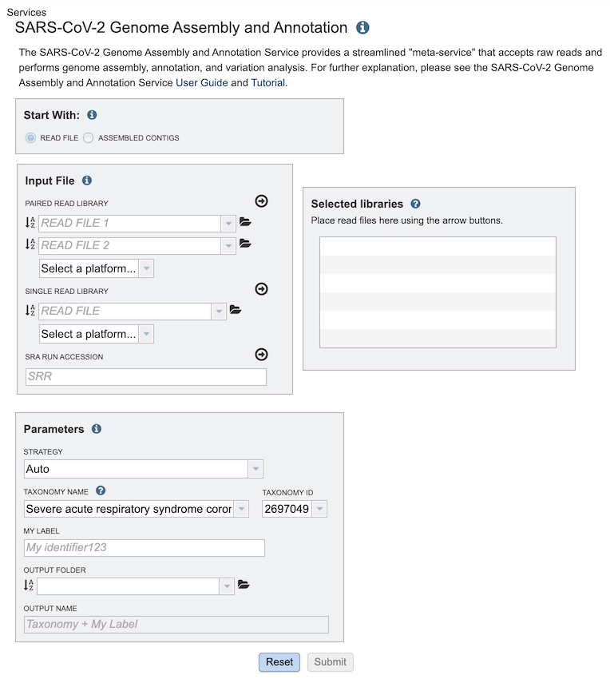

# SARS-CoV-2 Genome Assembly and Annotation Service

## Overview
The SARS-CoV-2 Genome Assembly and Annotation Service provides a streamlined **"meta-service"** that accepts raw reads and performs genome assembly, annotation, and variation analysis for SARS-CoV-2 genome reads.

## Using the SARS-CoV-2 Genome Assembly and Annotation Service
*Note: You must be logged in to use this service.*

## Options

## Start with
The service can accept either read files or assembled contigs. If the "Read Files" option is selected, the Assembly Service will be invoked automatically to assemble the reads into contigs before invoking the Annotation Service. If the "Assembled Contigs" option is chosen, the Annotation Service will automatically be invoked, bypassing the Assembly Service.

## Read Input File
Depending on the option chosen above (Read File or Assembled Contigs), the Input File section will request read files or assembled contigs, respectively.

### Paired read library
**Read File 1 & 2:**  Many paired read libraries are given as file pairs, with each file containing half of each read pair. Paired read files are expected to be sorted such that each read in a pair occurs in the same Nth position as its mate in their respective files. These files are specified as READ FILE 1 and READ FILE 2. For a given file pair, the selection of which file is READ 1 and which is READ 2 does not matter.

### Single read library
**Read File:** The fastq file containing the reads.

### SRA run accession
Allows direct upload of read files from the [NCBI Sequence Read Archive](https://www.ncbi.nlm.nih.gov/sra) to the PATRIC Assembly Service. Entering the SRR accession number and clicking the arrow will add the file to the selected libraries box for use in the assembly.

## Selected libraries
Read files placed here will contribute to a single assembly.

## Parameters

### Strategy

**auto:** Uses CDC-Illumina or CDC-Nanopore protocol based on the type of reads provided. 
  
**CDC-Illumina:** Implements CDC-prescribed assembly [protocol for SARS-CoV-2 genome sequences](https://github.com/CDCgov/SARS-CoV-2_Sequencing/blob/master/protocols/CDC-Comprehensive/CDC_SARS-CoV-2_Sequencing_200325-2.pdf) for Illumina-generated sequences.

**CDC-Nanopore:** Implements CDC-prescribed assembly [protocol for SARS-CoV-2 genome sequences](https://github.com/CDCgov/SARS-CoV-2_Sequencing/blob/master/protocols/CDC-Comprehensive/CDC_SARS-CoV-2_Sequencing_200325-2.pdf) for Nanopore-generated sequences.

**ARTIC-Nanopore:** Implements the ARTICnetwork-prescribed [protocol for nCoV-19 genome sequences](https://artic.network/ncov-2019/ncov2019-bioinformatics-sop.html) for Nanopore-generated sequences. 

### Taxonomy Name
Taxon must be specified at the genus level or below to get the latest protein family predictions.

### Taxonomy ID
Auto-populated after entering Taxonomy Name. If a Taxonomy ID is entered, auto-populates the Taxonomy Name

### Genetic Code
The codon translation used in calling genes.

### Output Folder
The workspace folder where results will be placed.

### Output Name
Name used to uniquely identify results.

## Output Results

The Comprehensive Genome Analysis Service generates several files that are deposited in the Private Workspace in the designated Output Folder. These include

 * **FullGenomeReport.html** - A web-browser-viewable report that summarizes the results of the service including
   * Summary information - genome name, quality,
   * Genome assembly information - contigs, GC content, plasmids, L50, genome length, chromosomes
   * Genome annotation information - taxonomy, CDS, tRNA, rRNA, partial CDS, misc RNA, repeat regions, protein feature summary, circular view with annotations
   * Specialty genes - antibiotic resistance, drug targets, transporters, virulence factors
   * Subsystem analysis - summary
   * Phylogenetic analysis - phylogenetic tree generated using the analyzed genome and the closest Reference and Representative genomes
   * References - citations to all tools used by the service
 * **annotated.genome** - A special "Genome Typed Object (GTO)" JSON-format file that encapsulates all the data from the annotated genome. See [Extracting and Mining Genome Typed Objects](https://docs.patricbrc.org/cli_tutorial/cli_getting_started.html#extracting-and-mining-genome-typed-objects-gtos) for more information.
 * **annotation** - The Annotation sub-job that was run as part of the CGA Service. Double-clicking this item will display the Annotation job results. Note that sub-jobs are indicated by the "checkered flag" icon beside the name.
 * **assembly** - The Assembly sub-job that was run as part of the CGA Service. Double-clicking this item will display the Assembly job results. Note that sub-jobs are indicated by the "checkered flag" icon beside the name.
 * **circos.svg** - SVG-format rendering of the circular genome view used in the FullGenomeReport.html file.
 * **circos.png** - PNG-format rendering of the circular genome view used in the FullGenomeReport.html file.
 * **codonTree.nex** - NEXUS-format file containing the phylogenetic tree generated by the CGA Service.
 * **codonTree.nwk** - Newick-format file containing the phylogenetic tree generated by the CGA Service.
 * **codonTree.stats** - File containing the statistics on the phylogenetic tree generated by the CGA Service.
 * **codonTree.svg** - SVG-format rendering of the phylogenetic tree used in the FullGenomeReport.html file.
 * **subsystem_colors.json** - JSON-format file used for rendering colors in the Subsystem pie chart displayed in the FullGenomeReport.html file.
 * **tree_ingroup.txt** - File containing the closely related genomes used in building the ingroup for the phylogenetic tree generated by the CGA Service.

## References
1. Wick, R.R., et al., Unicycler: resolving bacterial genome assemblies from short and long sequencing reads. PLoS computational biology, 2017. 13(6): p. e1005595.
2. Bankevich, A., et al., SPAdes: a new genome assembly algorithm and its applications to single-cell sequencing. Journal of computational biology, 2012. 19(5): p. 455-477.
3. Koren, S., et al., Canu: scalable and accurate long-read assembly via adaptive k-mer weighting and repeat separation. Genome research, 2017. 27(5): p. 722-736.
4. Nurk, S., et al., metaSPAdes: a new versatile metagenomic assembler. Genome research, 2017. 27(5): p. 824-834.
5. Antipov, D., et al., plasmidSPAdes: assembling plasmids from whole genome sequencing data. bioRxiv, 2016: p. 048942.
6. Krueger, F., Trim Galore: a wrapper tool around Cutadapt and FastQC to consistently apply quality and adapter trimming to FastQ files, with some extra functionality for MspI-digested RRBS-type (Reduced Representation Bisufite-Seq) libraries. URL http://www. bioinformatics. babraham. ac. uk/projects/trim_galore/.(Date of access: 28/04/2016), 2012.
7. Vaser, R., et al., Fast and accurate de novo genome assembly from long uncorrected reads. Genome research, 2017. 27(5): p. 737-746.
8. Walker, B.J., et al., Pilon: an integrated tool for comprehensive microbial variant detection and genome assembly improvement. PloS one, 2014. 9(11): p. e112963.
9. Brettin, T., et al., RASTtk: a modular and extensible implementation of the RAST algorithm for building custom annotation pipelines and annotating batches of genomes. Scientific reports, 2015. 5: p. 8365.
10. Davis, J.J., et al., PATtyFams: Protein families for the microbial genomes in the PATRIC database. 2016. 7: p. 118.
11. Overbeek, R., et al., The SEED and the Rapid Annotation of microbial genomes using Subsystems Technology (RAST). Nucleic Acids Res, 2014. 42(Database issue): p. D206-14.
12. Ondov, B.D., et al., Mash: fast genome and metagenome distance estimation using MinHash. Genome biology, 2016. 17(1): p. 132.
13. Davis, J.J., et al., PATtyFams: Protein Families for the Microbial Genomes in the PATRIC Database. Front Microbiol, 2016. 7: p. 118.
14. Edgar, R.C., MUSCLE: multiple sequence alignment with high accuracy and high throughput. Nucleic acids research, 2004. 32(5): p. 1792-1797.
15. Stamatakis, A., RAxML version 8: a tool for phylogenetic analysis and post-analysis of large phylogenies. Bioinformatics, 2014. 30(9): p. 1312-1313.
