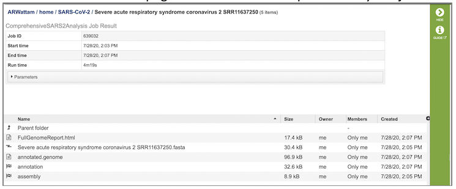

# SARS-CoV-2 Genome Assembly and Annotation Service

## Overview
The SARS-CoV-2 Genome Assembly and Annotation Service provides a streamlined **"meta-service"** that accepts raw reads and performs genome assembly, annotation, and variation analysis for SARS-CoV-2 genome reads.

## Using the SARS-CoV-2 Genome Assembly and Annotation Service
*Note: You must be logged in to use this service.*

## Options

## Start with
The service can accept either read files or assembled contigs. If the "Read Files" option is selected, the Assembly Service will be invoked automatically to assemble the reads into contigs before invoking the Annotation Service. If the "Assembled Contigs" option is chosen, the Annotation Service will automatically be invoked, bypassing the Assembly Service.

## Read Input File
Depending on the option chosen above (Read File or Assembled Contigs), the Input File section will request read files or assembled contigs, respectively.

### Paired read library
**Read File 1 & 2:**  Many paired read libraries are given as file pairs, with each file containing half of each read pair. Paired read files are expected to be sorted such that each read in a pair occurs in the same Nth position as its mate in their respective files. These files are specified as READ FILE 1 and READ FILE 2. For a given file pair, the selection of which file is READ 1 and which is READ 2 does not matter.

### Single read library
**Read File:** The fastq file containing the reads.

### SRA run accession
Allows direct upload of read files from the [NCBI Sequence Read Archive](https://www.ncbi.nlm.nih.gov/sra) to the PATRIC Assembly Service. Entering the SRR accession number and clicking the arrow will add the file to the selected libraries box for use in the assembly.

## Selected libraries
Read files placed here will contribute to a single assembly.

## Parameters

### Strategy

**auto:** Uses CDC-Illumina or CDC-Nanopore protocol based on the type of reads provided (see below). 
  
**CDC-Illumina:** Implements CDC-prescribed assembly [protocol for SARS-CoV-2 genome sequences](https://github.com/CDCgov/SARS-CoV-2_Sequencing/blob/master/protocols/CDC-Comprehensive/CDC_SARS-CoV-2_Sequencing_200325-2.pdf) for Illumina-generated sequences.

**CDC-Nanopore:** Implements CDC-prescribed assembly [protocol for SARS-CoV-2 genome sequences](https://github.com/CDCgov/SARS-CoV-2_Sequencing/blob/master/protocols/CDC-Comprehensive/CDC_SARS-CoV-2_Sequencing_200325-2.pdf) for Nanopore-generated sequences.

**ARTIC-Nanopore:** Implements the ARTICnetwork-prescribed [protocol for nCoV-19 genome sequences](https://artic.network/ncov-2019/ncov2019-bioinformatics-sop.html) for Nanopore-generated sequences. 

### Taxonomy Name
Pre-populated with the appropriate taxonomy name for SARS-CoV-2. 

### Taxonomy ID
Pre-populated with the appropriate taxonomy ID for SARS-CoV-2.

### My Label
User-provided name to uniquely identify the results.

### Output Folder
User-selected workspace folder where results will be placed.

### Output Name
Auto-generated name for the results (Taxonomy Name + My Label)

## Output Results

The SARS-CoV-2 Genome Assembly and Annotation Service generates several files that are deposited in the Private Workspace in the designated Output Folder. These include
 * **FullGenomeReport.html** - A web-browser-viewable report that summarizes the results of the service including
   * Assembly statistics
   * Assembly coverage depth graph
   * Variation data, including contig, SNP position, reference genome nucleotide, submitted genome nucleotide
   * Annotation summary with table of called features including ID, start position, strand, length, and function for each
 * **(output name).fasta** - Annotated genome in FASTA format
 * **annotated.genome** - A JSON-format file encapsulating all the data from the annotated genome
 * **annotation** - Job output from the annotion portion of the service. Provides a collection of output files:
   * annotation.feature_dna.fasta - DNA sequence for each feature called by the annotation pipeline
   * annotation.feature_protein.fasta contains the amino sequence for each gene called by the annotation pipeline
   * annotation.features file contains a list of the features, where they are located on the contig, their type, their function, any known alias, and (for protein-coding genes) the protein MD5 checksum
   * annotation.gb file contains the annotation in GenBank format
   * annotation.gff lists all the features of the genome in a General Feature Format
   * merged.gb has all of the contigs merged into a single locus instead of being separate locus objects.  The merged.gb can be used in artemis
   * annotation.tar.gz is a tar ball file where all of files are wrapped up in one single file
   * annotation.txt file contains all the information on the called features, including the nucleotide and amino acid sequences
   * annotation.xls file contains all the information on the called features, including the nucleotide and amino acid sequences, but in excel format
   * vigor4.stderr.txt file shows any standard errors that result from the VIGOR4 annotation pipeline
   * vigor4.stdout.txt file shows the output of the VIGOR4 annotation pipeline at each step in the process
   * vigor_out-20200729-135437.ini file contains the set of VIGOR4 settings that were used to compute that annotation
   * vigor.out.aln file contains alignment  of  predicted  protein  to  reference, and from the reference protein to genome
   * vigor_out.cds file is a fasta file of predicted CDSs
   * vigor_out.gff3 file shows the  predicted features in GFF3 format
   * vigor_out.rpt file shows the summary results from the annotation program
   * vigor_out.pep file shows the fata file of the predicted proteins
   * vigor_out.tbl file shows the predicted features in GenBank table format
   * vigor_out.warnings file shows any warning produced by the VIGOR4 pipeline when it generated the annotation
   * 
   
   
   
 

 
 
 

Genome annotation information - taxonomy, CDS, tRNA, rRNA, partial CDS, misc RNA, repeat regions, protein feature summary, circular view with annotations
   * Specialty genes - antibiotic resistance, drug targets, transporters, virulence factors
   * Subsystem analysis - summary
   * Phylogenetic analysis - phylogenetic tree generated using the analyzed genome and the closest Reference and Representative genomes
   * References - citations to all tools used by the service
 * **annotated.genome** - A special "Genome Typed Object (GTO)" JSON-format file that encapsulates all the data from the annotated genome. See [Extracting and Mining Genome Typed Objects](https://docs.patricbrc.org/cli_tutorial/cli_getting_started.html#extracting-and-mining-genome-typed-objects-gtos) for more information.
 * **annotation** - The Annotation sub-job that was run as part of the CGA Service. Double-clicking this item will display the Annotation job results. Note that sub-jobs are indicated by the "checkered flag" icon beside the name.
 * **assembly** - The Assembly sub-job that was run as part of the CGA Service. Double-clicking this item will display the Assembly job results. Note that sub-jobs are indicated by the "checkered flag" icon beside the name.
 * **circos.svg** - SVG-format rendering of the circular genome view used in the FullGenomeReport.html file.
 * **circos.png** - PNG-format rendering of the circular genome view used in the FullGenomeReport.html file.
 * **codonTree.nex** - NEXUS-format file containing the phylogenetic tree generated by the CGA Service.
 * **codonTree.nwk** - Newick-format file containing the phylogenetic tree generated by the CGA Service.
 * **codonTree.stats** - File containing the statistics on the phylogenetic tree generated by the CGA Service.
 * **codonTree.svg** - SVG-format rendering of the phylogenetic tree used in the FullGenomeReport.html file.
 * **subsystem_colors.json** - JSON-format file used for rendering colors in the Subsystem pie chart displayed in the FullGenomeReport.html file.
 * **tree_ingroup.txt** - File containing the closely related genomes used in building the ingroup for the phylogenetic tree generated by the CGA Service.

## References
* Etherington, G.J., R.H. Ramirez-Gonzalez, and D. MacLean, bio-samtools 2: a package for analysis and visualization of sequence and alignment data with SAMtools in Ruby. Bioinformatics, 2015. 31(15): p. 2565-2567.
* Langmead, B. and S. Salzberg, Langmead. 2013. Bowtie2. Nature Methods, 2013. 9: p. 357-359.
* Li, H., Minimap2: pairwise alignment for nucleotide sequences. Bioinformatics, 2018. 34(18): p. 3094-3100.
* Martin, M., Cutadapt removes adapter sequences from high-throughput sequencing reads. EMBnet. journal, 2011. 17(1): p. 10-12.

