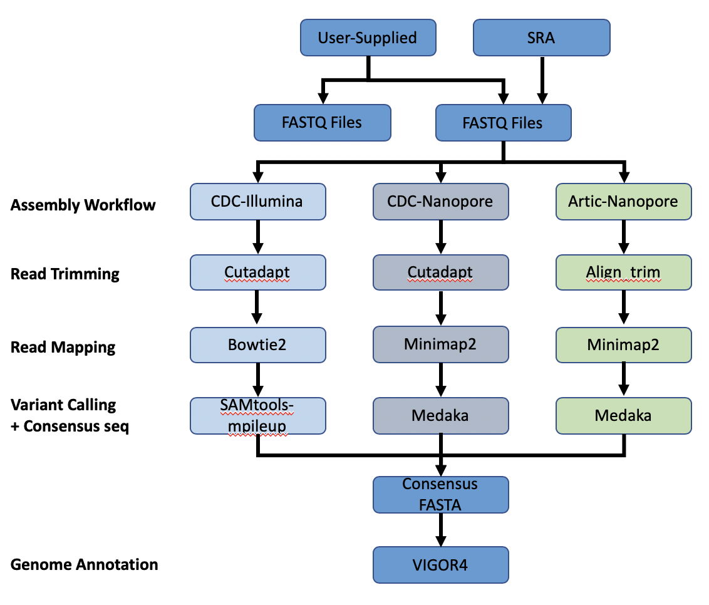

# SARS-CoV-2 Genome Assembly and Annotation Service

## Overview
The SARS-CoV-2 Genome Assembly and Annotation Service provides a streamlined **"meta-service"** that accepts raw reads and performs genome assembly, annotation, and variation analysis for SARS-CoV-2 genome reads. The figure below provides an overview of the workflows of the service.

## Using the SARS-CoV-2 Genome Assembly and Annotation Service
*Note: You must be logged in to use this service.*

## Options

## Start with
The service can accept either read files or assembled contigs. If the "Read Files" option is selected, the Assembly Service will be invoked automatically to assemble the reads into contigs before invoking the Annotation Service. If the "Assembled Contigs" option is chosen, the Annotation Service will automatically be invoked, bypassing the Assembly Service.

## Read Input File
Depending on the option chosen above (Read File or Assembled Contigs), the Input File section will request read files or assembled contigs, respectively.

### Paired read library
**Read File 1 & 2:**  Many paired read libraries are given as file pairs, with each file containing half of each read pair. Paired read files are expected to be sorted such that each read in a pair occurs in the same Nth position as its mate in their respective files. These files are specified as READ FILE 1 and READ FILE 2. For a given file pair, the selection of which file is READ 1 and which is READ 2 does not matter.

### Single read library
**Read File:** The fastq file containing the reads.

### SRA run accession
Allows direct upload of read files from the [NCBI Sequence Read Archive](https://www.ncbi.nlm.nih.gov/sra) to the PATRIC Assembly Service. Entering the SRR accession number and clicking the arrow will add the file to the selected libraries box for use in the assembly.

## Selected libraries
Read files placed here will contribute to a single assembly.

## Parameters

### Strategy

**auto:** Uses CDC-Illumina or CDC-Nanopore protocol based on the type of reads provided (see below). 
  
**CDC-Illumina:** Implements CDC-prescribed assembly [protocol for SARS-CoV-2 genome sequences](https://github.com/CDCgov/SARS-CoV-2_Sequencing/blob/master/protocols/CDC-Comprehensive/CDC_SARS-CoV-2_Sequencing_200325-2.pdf) for Illumina-generated sequences.

**CDC-Nanopore:** Implements CDC-prescribed assembly [protocol for SARS-CoV-2 genome sequences](https://github.com/CDCgov/SARS-CoV-2_Sequencing/blob/master/protocols/CDC-Comprehensive/CDC_SARS-CoV-2_Sequencing_200325-2.pdf) for Nanopore-generated sequences.

**ARTIC-Nanopore:** Implements the ARTICnetwork-prescribed [protocol for nCoV-19 genome sequences](https://artic.network/ncov-2019/ncov2019-bioinformatics-sop.html) for Nanopore-generated sequences. 

### Taxonomy Name
Pre-populated with the appropriate taxonomy name for SARS-CoV-2. 

### Taxonomy ID
Pre-populated with the appropriate taxonomy ID for SARS-CoV-2.

### My Label
User-provided name to uniquely identify the results.

### Output Folder
User-selected workspace folder where results will be placed.

### Output Name
Auto-generated name for the results (Taxonomy Name + My Label)

## Output Results

The SARS-CoV-2 Genome Assembly and Annotation Service generates several files that are deposited in the Private Workspace in the designated Output Folder. These include
 * **FullGenomeReport.html** - A web-browser-viewable report that summarizes the results of the service including
   * Assembly statistics
   * Assembly coverage depth graph
   * Variation data, including contig, SNP position, reference genome nucleotide, submitted genome nucleotide
   * Annotation summary with table of called features including ID, start position, strand, length, and function for each
 * **(output name).fasta** - Annotated genome in FASTA format
 * **annotated.genome** - A JSON-format file encapsulating all the data from the annotated genome
 * **annotation** - Job output from the annotion portion of the service. Provides a collection of output files:
   * annotation.feature_dna.fasta - DNA sequence for each feature called by the annotation pipeline
   * annotation.feature_protein.fasta - amino sequence for each gene called by the annotation pipeline
   * annotation.features - list of the features, location on contig, type, function, any known alias, and (for protein-coding genes) the protein MD5 checksum
   * annotation.gb - annotation in GenBank format
   * annotation.gff - features of the genome in a General Feature Format
   * merged.gb - all of the contigs merged into a single locus instead of being separate locus objects; can be used in Artemis
   * annotation.tar.gz - tar ball file containing all files
   * annotation.txt - all information on the called features, including the nucleotide and amino acid sequences, in text file format
   * annotation.xls - all information on the called features, including the nucleotide and amino acid sequences, in Excel format
   * vigor4.stderr.txt - standard errors that result from the VIGOR4 annotation pipeline
   * vigor4.stdout.txt - output of the VIGOR4 annotation pipeline at each step in the process
   * vigor_out-20200729-135437.ini - VIGOR4 settings that were used to compute that annotation
   * vigor.out.aln file - alignment  of  predicted  protein  to  reference, and from the reference protein to genome
   * vigor_out.cds - FASTA-format file of predicted CDSs
   * vigor_out.gff3 - predicted features in GFF3 format
   * vigor_out.rpt - summary results from the annotation program
   * vigor_out.pep - EMBL-format file of the predicted proteins
   * vigor_out.tbl - predicted features in GenBank table format
   * vigor_out.warnings - any warnings produced by the VIGOR4 pipeline during annotation
 * **assembly** - Job output from the assembly portion of the service. Provides a collection of output files:
   * assembly-details.json - information about the assembly in JSON-format
   * assembly.bam - a Binary Alignment Map (BAM) containing comprehensive raw data of genome sequencing
   * assembly.bam.bai - BAM index file
   * assembly.depth - depth of support based on the reads at each position in the assembly
   * assembly.fasta - nucleotide sequence of the contig
   * assembly.png - graph that shows the coverage depth for the assembly at the specific positions in the genome, also shown in the Full Genome Report
   * vc.gz and vcfgz.tbi - Variant Call Format (VCF) specification VCF, a (compressed) text file containing meta-information lines, a header line, and then data lines each containing information about a position in the genome; can contain genotype information on samples for each position

## References
* Etherington, G.J., R.H. Ramirez-Gonzalez, and D. MacLean, bio-samtools 2: a package for analysis and visualization of sequence and alignment data with SAMtools in Ruby. Bioinformatics, 2015. 31(15): p. 2565-2567.
* Langmead, B. and S. Salzberg, Langmead. 2013. Bowtie2. Nature Methods, 2013. 9: p. 357-359.
* Li, H., Minimap2: pairwise alignment for nucleotide sequences. Bioinformatics, 2018. 34(18): p. 3094-3100.
* Martin, M., Cutadapt removes adapter sequences from high-throughput sequencing reads. EMBnet. journal, 2011. 17(1): p. 10-12.

