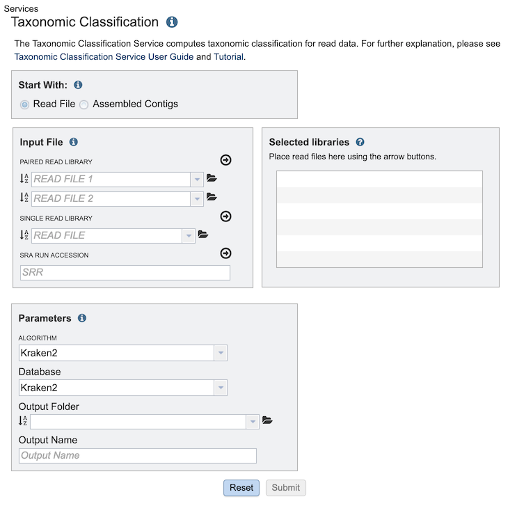

# Taxonomic Classification Service

## Overview
The Taxonomic Classification Service accepts reads or contigs from sequencing of a metagenomic sample and uses [Kraken 2](http://genomebiology.com/2014/15/3/R46) to assign the reads to taxonomic bins, providing an initial profile of the possible constituent organisms present in the sample.

### See also
  * [Taxonomic Classification Service](https://patricbrc.org/app/TaxonomicClassification)
  * Taxonomic Classification Service Tutorial - TBD
  * [Metagenome Binning Service](./metagenome_binning_service.html)

## Using the Taxonomic Classification Service
The **Taxonomic Classification** submenu option under the **Services** main menu (Metagenomics category) opens the Taxonomic Classification input form (shown below). *Note: You must be logged into PATRIC to use this service.*

## Options

## Start With
The service can accept either read files or assembled contigs. If the "Read File" option is selected, the form will provide controls to allow input of read files or SRA accession numbers.  If the "Assembled Contigs" option is selected, the form will change to allow input of a contig file.   

## Input File
Depending on the option chosen above (Read File or Assembled Contigs), the Input File section will request read files or assembled contigs, respectively.

### Paired read library
**Read File 1 & 2:**  Many paired read libraries are given as file pairs, with each file containing half of each read pair. Paired read files are expected to be sorted such that each read in a pair occurs in the same Nth position as its mate in their respective files. These files are specified as READ FILE 1 and READ FILE 2. For a given file pair, the selection of which file is READ 1 and which is READ 2 does not matter.

### Single read library
**Read File:** The fastq file containing the reads.

### SRA run accession
Allows direct upload of read files from the [NCBI Sequence Read Archive](https://www.ncbi.nlm.nih.gov/sra) to the PATRIC Assembly Service. Entering the SRR accession number and clicking the arrow will add the file to the selected libraries box for use in the assembly.

## Selected libraries
Read files placed here will contribute to a single assembly.

## Parameters

### Algorithm

 * [Kraken 2](http://genomebiology.com/2014/15/3/R46) - Assigns taxonomic labels to metagenomic DNA sequences using exact alignmnet of k-mers.

### Database
Reference taxonomic database used by the algorithm.

* [Kraken 2](https://ccb.jhu.edu/software/kraken2/index.shtml?t=manual#standard-kraken-2-database) - Standard Kraken 2 database containing distinct 31-mers, based on completed microbial genomes from NCBI.
* [RDP](https://doi.org/10.1128/AEM.00062-07) - The Ribosomal Database Project (RDP), a naïve Bayesian-based classification for bacterial 16S rRNA sequences.
* [SILVA](https://doi.org/10.1093/nar/gkt1209) - Comprehensive database of aligned ribosomal RNA (rRNA) gene sequences from the Bacteria, Archaea and Eukaryota domains and supplementary online services. 

### Output Folder
The workspace folder where results will be placed.

### Output Name
Name used to uniquely identify results.

## Output Results

The Taxonomic Classification Service generates several files that are deposited in the Private Workspace in the designated Output Folder. These include

 * **TaxonomicReport.html** - A web-browser-viewable report that summarizes the results of the service including
   * Input Data - read files used
   * Results - a table of the top taxonomic hits
   * Link to interactive chart showing the taxonomic classification distribution
 * **chart.html** -   
   

 
## References
 * Wang Q, Garrity GM, Tiedje JM, Cole JR. Naïve Bayesian classifier for rapid assignment of rRNA sequences into the new bacterial taxonomy. Appl Environ Microbiol. 2007; 73(16):5261–7. doi:10.1128/AEM.00062-07
 * Wood DE, Salzberg SL: Kraken: ultrafast metagenomic sequence classification using exact alignments. Genome Biology 2014, 15:R46.
 * Yilmaz P, Parfrey LW, Yarza P, Gerken J, Pruesse E, Quast C, Schweer T, Peplies J, Ludwig W, Glöckner FO. The SILVA and “All-species Living Tree Project (LTP)” taxonomic frameworks. Nucleic Acids Res. 2014; 42(Database issue):643–8.
 
 
