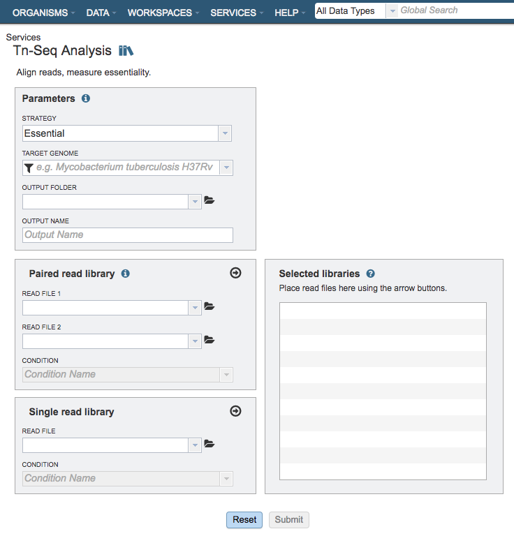

# Tn-Seq Analysis Service

## Overview
The Tn-Seq Analysis Service facilitates determination of essential and conditionally essential regions in bacterial genomes from data generated from transposon insertion sequencing (Tn-Seq) experiments. Tn-Seq (in the broad sense used here) refers to a family of related methods that use deep sequencing to survey a transposon insertion library and quantify the abundance of insertions at different sites in the genome.

*Note: The PATRIC Tn-Seq Analysis Service wraps the [TRANSIT](http://journals.plos.org/ploscompbiol/article?id=10.1371/journal.pcbi.1004401) software.  Please cite this reference when publishing results from this service:*

* DeJesus, M. A., Ambadipudi, C., Baker, R., Sassetti, C., & Ioerger, T. R. (2015). TRANSIT-a software tool for Himar1 TnSeq analysis. *PLoS computational biology*, *11*(10), e1004401.

### See also
* [Tn-Seq Analysis Service](https://patricbrc.org/app/Tnseq)
* [Tn-Seq Analysis Service Tutorial](https://docs.patricbrc.org//tutorial/tn-seq/tn-seq.html)

## Using the Genome Assembly Service
The **Tn-Seq Analysis** submenu option under the **Services** main menu (Genomics category) opens the Tn-Seq Analysis input form (*shown below*). *Note: You must be logged into PATRIC to use this service.*

## Options
 

## Parameters

### Strategy
This parameter determines whether the genes are determined to be essential in a single condition or by comparison to a control.

**Essential:** Runs the
[TRANSIT](http://journals.plos.org/ploscompbiol/article?id=10.1371/journal.pcbi.1004401)
software. With this strategy selected TRANSIT will calculate the probability of being essential using the Gumbel or Extreme Value distribution.

**Conditionally Essential:** Runs the
[TRANSIT](http://journals.plos.org/ploscompbiol/article?id=10.1371/journal.pcbi.1004401)
software. With this strategy selected TRANSIT will operate in "resampling" mode and use the difference between the sum of read-counts in each condition to calculate the probability of being essential.

### Target Genome
A target genome to align the reads against. If this genome is a private genome, the search can be narrowed by clicking on the filter icon under the words Target Genome.

### Output Folder
The workspace folder where results will be placed.

### Output Name
Name used to uniquely identify results.

## Paired read library

### Read File 1 & 2
Many paired read libraries are given as file pairs, with each file containing half of each read pair. Paired read files are expected to be sorted such that each read in a pair occurs in the same Nth position as its mate in their respective files. These files are
specified as READ FILE 1 and READ FILE 2. For a given file pair, the selection of which file is READ 1 and which is READ 2 does not matter.

### Condition
The group/condition specified will be used to determine contrasts in the conditionally essential mode. Reads assigned to the same group will be used as replicates. Choose whether the sample is a treatment or control.

## Selected Libraries
Read files placed here will contribute to a single Tn-Seq analysis. Read files placed into this table under the same condition will be considered replicates.
