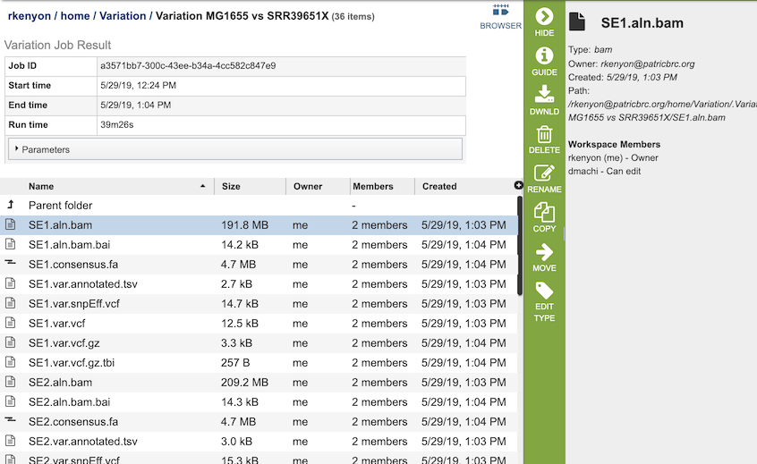

# Variation Analysis Service

## Overview
The Variation Analysis Service can be used to identify and annotate sequence variations. The service enables users to upload one or multiple short read samples and compare them to a closely related reference genome. For each sample, the service computes the variations against the reference and presents a detailed list of SNPs, MNPs, insertions and deletions with confidence scores and effects such as "synonymous mutation" and "frameshift." High confidence variations are downloadable in the standard VCF format augmented by SNP annotation. A summary table illustrating how the variations are shared across the samples is also available.

### See also
* [Variation Analyis Service](https://patricbrc.org/app/Variation)
* [Variation Analysis Service Tutorial](https://docs.patricbrc.org//tutorial/variation_analysis_service/variation_analysis_service.html)

## Using the Variation Analysis Service
The **Variation** submenu option under the **Services** main menu (Genomics category) opens the Variation Service input form (*shown below*). *Note: You must be logged into PATRIC to use this service.*

## Options

## Paired read library

### Read File 1 & 2
Many paired read libraries are given as file pairs, with each file containing half of each read pair. Paired read files are expected to be sorted such that each read in a pair occurs in the same Nth position as its mate in their respective files. These files are specified as READ FILE 1 and READ FILE 2. For a given file pair, the selection of which file is READ 1 and which is READ 2 does not matter.

## Parameters

### Aligner

**BWA-mem:** BWA-mem is well-rounded aligner for mapping short sequence reads or long query sequences against a large reference genome. It automatically chooses between local and end-to-end alignments, supports paired-end reads and performs chimeric alignment. The algorithm is robust to sequencing errors and applicable to a wide range of sequence lengths from 70bp to a few megabases.

**BWA-mem-strict:** BWA-mem-strict is BWA-mem with the default parameters plus "-B9 -O16" to increase the gap extension and clipping penalty. These strict mapping parameters are recommended for cases where contigs and references are known to be very close to each other.

**Bowtie2:** Bowtie2 is an aligner that combines the advantages of the full-text minute index and SIMD dynamic programming, achieves very fast and memory-efficient gapped alignment of sequencing reads. It improves on the previous Bowtie method in terms of speed and fraction of reads aligned and is substantially faster than non-“full-text minute index“-based approaches while aligning a comparable fraction of reads. Bowtie 2 performs sensitive gapped alignment without incurring serious computational penalties.

**LAST:** LAST can handle big sequence data, like comparing two vertebrate genomes. It can align billions of DNA reads to a genome, and will indicate reliability of each aligned column. In addition, it can compare DNA to proteins, with frameshifts, compare PSSMs to sequences,
calculates the likelihood of chance similarities between random sequences, does split and spliced alignment, and can be trained for unusual kinds of sequences (like nanopore).

### SNP Caller

**FreeBayes:** FreeBayes is an accurate method for sequence organization that includes fragment clustering, paralogue identification and multiple alignment. It calculates the probability that a given site is polymorphic and has an automated evaluation of the full length of all sequences, without limitations on alignment depth.

**SAMtools:** SAMtools implements various utilities for post-processing alignments in the SAM format, such as indexing, variant caller and alignment viewer, and thus provides universal tools for processing read alignments. This option invokes the BCFtools' SNP calling algorithm on top of SAMtools' mpileup result.

### Target Genome
A target genome to align the reads against. If this genome is a private genome, the search can be narrowed by clicking on the filter icon under the words Target Genome.

### Output Folder
The workspace folder where results will be placed.

### Output Name
Name used to uniquely identify results.

## Selected Libraries
Read files placed here will contribute to a single analysis.

## Buttons

**Reset:** Resets the input form to default values

**Submit:** Launches the Variation Analysis job

## Results

The Variation Service generates several files that are deposited in the Private Workspace in the designated Output Folder. These include 

* **bam** - a Binary Alignment/Map (BAM) file which is the companion format of the Sequence Alignment/Map (SAM) format. A SAM file (.sam) is a tab-delimited text file that contains sequence alignment data. The .bam format is compact in size and supports fast retrieval of alignments in specified regions. It is optimal for viewing in a genome browser. A bam file is generated for each of the read libraries that were loaded.
* **tsv** - tab-separated-value file that summarizes the locations of the variants, shows the nucleotide change, and identifies if it was a synonymous or nonsynonymous substitution, or an indel. It also identifies the gene, or intergenic region, where the variation occurred. A tsv file is generated for each of the read libraries that were loaded.
* **libs.txt** - text file that describes the libraries used in the comparison.
* **summary.txt** files. This file provides a summary of the analysis. For each library it shows the number of reads, those that mapped to the reference, the number of bases in the reference, the median base coverage, bases with zero coverage, bases with less than (or equal to) 10 reads coverage, the raw variants that are detected by the variation calling tool, and those variants that have a high quality score.
* **var.snpEFF.vcf** output file of SnpEff which rapidly categorizing the effects of variants in genome sequences. Once a genome is sequenced, SnpEff annotates variants based on their genomic locations and predicts coding effects. Annotated genomic locations include intronic, untranslated region, upstream, downstream, splice site, or intergenic regions. Coding effects such as synonymous or non-synonymous amino acid replacement, start codon gains or losses, stop codon gains or losses, or frame shifts can be predicted. A var.snpEFF.vcf file is generated for each of the read libraries that were loaded.
* **var.snp.vcf** shows the location of the SNP on the genome. A var.snp.vcf file is generated for each of the read libraries that were loaded.
* **.html** - opens a webpage that shows the same data available in the .tsv file. This column definitions are as follows: 
  * Samples - internal library read name. The corresponding user library read name can be found in libs.txt
  * Contig - contig name
  * Pos - position of the variation
  * Ref - reference nucleotide(s) at the variation position
  * Var - variant nucleotide(s) at the variation position
  * Score - quality score from the variant caller tool
  * Var_cov - variant coverage (the average read depth of the variant)
  * Var_frac - variant fraction (the fraction of the variant read depth among the all the reads that cover this region)
  * Type - variant type
  * Ref_nt - reference nucleotide(s)
  * Var_nt - variant nucleotide(s)
  * Ref_nt_pos_change - nucleotide change
  * Ref_aa_pos_change - amino acid change
  * Frameshift - frameshift variant
  * Gene_ID - PATRIC feature (peg) id
  * Locus_tag - RefSeq locus tag
  * Gene_name - gene name
  * Function - function description
  * Upstream_feature - upstream feature
  * Downstream_feature - downstream feature
  * snpEff_type - snpEFF variant type
  * snpEff_impact - snpEFF variant impact
* **var.vcf.gz.tbi** - can be uploaded into a genome browser for viewing. A var.vcf.gz.tbi file is generated for each of the read libraries that were loaded.

### Action buttons
After selecting one of the output files by clicking it, a set of options becomes available in the vertical green Action Bar on the right side of the table, listed below. To find out more about the different options for using these output files, see the [Variation Analysis Service Tutorial](https://docs.patricbrc.org//tutorial/variation_analysis_service/variation_analysis_service.html).

* **Hide/Show:** Toggles (hides) the right-hand side Details Pane.
* **Guide:** Link to the corresponding User Guide
* **Download:**  Downloads the selected item.
* **View:** Displays the content of the file, typically as plain text or rendered html, depending on filetype. Only available for html, txt, and tsv file types.
* **Delete:** Deletes the file.
* **Rename:** Allows renaming of the file.
* **Copy:** Copies the selected items to the clipboard.
* **Move:** Allows moving of the file to another folder.
* **Edit Type:** Allows changing of the type of the file in terms of how PATRIC interprets the content and uses it in other services or parts of the website.  Allowable types include unspecified, contigs, nwk, reads, differential expression input data, and differential expression input metadata.

More details are available in the [Action Buttons](../action_buttons.html) user guide.

## References
1. Li, H. (2014) Towards better understanding of artifacts in variant calling from high-coverage samples. Bioinformatics, btu356.
2. Langmead, B. and Salzberg, S.L. (2012) Fast gapped-read alignment with Bowtie 2. Nat Methods, 9, 357-359.
3. Lee, W.P., Stromberg, M.P., Ward, A., Stewart, C., Garrison, E.P. and Marth, G.T. (2014) MOSAIK: a hash-based algorithm for accurate next-generation sequencing short-read mapping. PLoS One, 9, e90581.
4. Frith, M.C., Hamada, M. and Horton, P. (2010) Parameters for accurate genome alignment. BMC bioinformatics, 11, 1.
5. Marth, G.T., Korf, I., Yandell, M.D., Yeh, R.T., Gu, Z., Zakeri, H., Stitziel, N.O., Hillier, L., Kwok, P.-Y. and Gish, W.R. (1999) A general approach to single-nucleotide polymorphism discovery. Nature genetics, 23, 452-456.
6. Li, H., Handsaker, B., Wysoker, A., Fennell, T., Ruan, J., Homer, N., Marth, G., Abecasis, G., Durbin, R. and Genome Project Data Processing, S. (2009) The Sequence Alignment/Map format and SAMtools. Bioinformatics, 25, 2078-2079.
7. Cingolani, P., Platts, A., Wang, L.L., Coon, M., Nguyen, T., Wang, L., Land, S.J., Lu, X. and Ruden, D.M. (2012) A program for annotating and predicting the effects of single nucleotide polymorphisms, SnpEff: SNPs in the genome of Drosophila melanogaster strain w1118; iso-2; iso-3. Fly, 6, 80-92.
