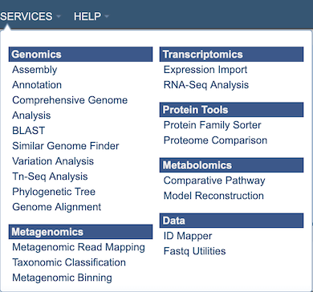

# Variation Analysis Service

## Overview
The Variation Analysis Service can be used to identify and annotate sequence variations. The service enables users to upload one or multiple short read samples and compare them to a closely related reference genome. For each sample, the service computes the variations against the reference and presents a detailed list of SNPs, MNPs, insertions and deletions with confidence scores and effects such as "synonymous mutation" and "frameshift." High confidence variations are downloadable in the standard VCF format augmented by SNP annotation. A summary table illustrating how the variations are shared across the samples is also available.

### See also
* [Variation Analyis Service](https://patricbrc.org/app/Variation)
* [Variation Analysis Service Tutorial](https://docs.patricbrc.org//tutorial/variation_analysis_service/variation_analysis_service.html)

## Using the Variation Analysis Service
The **Variation** submenu option under the **Services** main menu (Genomics category) opens the Variation Service input form (*shown below*). *Note: You must be logged into PATRIC to use this service.*

## Options

## Paired read library

### Read File 1 & 2
Many paired read libraries are given as file pairs, with each file containing half of each read pair. Paired read files are expected to be sorted such that each read in a pair occurs in the same Nth position as its mate in their respective files. These files are specified as READ FILE 1 and READ FILE 2. For a given file pair, the selection of which file is READ 1 and which is READ 2 does not matter.

## Parameters

### Aligner

**BWA-mem:** BWA-mem is well-rounded aligner for mapping short sequence reads or long query sequences against a large reference genome. It automatically chooses between local and end-to-end alignments, supports paired-end reads and performs chimeric alignment. The algorithm is robust to sequencing errors and applicable to a wide range of sequence lengths from 70bp to a few megabases.

**BWA-mem-strict:** BWA-mem-strict is BWA-mem with the default parameters plus "-B9 -O16" to increase the gap extension and clipping penalty. These strict mapping parameters are recommended for cases where contigs and references are known to be very close to each other.

**Bowtie2:** Bowtie2 is an aligner that combines the advantages of the full-text minute index and SIMD dynamic programming, achieves very fast and memory-efficient gapped alignment of sequencing reads. It improves on the previous Bowtie method in terms of speed and fraction of reads aligned and is substantially faster than non-“full-text minute index“-based approaches while aligning a comparable fraction of reads. Bowtie 2 performs sensitive gapped alignment without incurring serious computational penalties.

**LAST:** LAST can handle big sequence data, like comparing two vertebrate genomes. It can align billions of DNA reads to a genome, and will indicate reliability of each aligned column. In addition, it can compare DNA to proteins, with frameshifts, compare PSSMs to sequences,
calculates the likelihood of chance similarities between random sequences, does split and spliced alignment, and can be trained for unusual kinds of sequences (like nanopore).

### SNP Caller

**FreeBayes:** FreeBayes is an accurate method for sequence organization that includes fragment clustering, paralogue identification and multiple alignment. It calculates the probability that a given site is polymorphic and has an automated evaluation of the full length of all sequences, without limitations on alignment depth.

**SAMtools:** SAMtools implements various utilities for post-processing alignments in the SAM format, such as indexing, variant caller and alignment viewer, and thus provides universal tools for processing read alignments. This option invokes the BCFtools' SNP calling algorithm on top of SAMtools' mpileup result.

### Target Genome
A target genome to align the reads against. If this genome is a private genome, the search can be narrowed by clicking on the filter icon under the words Target Genome.

### Output Folder
The workspace folder where results will be placed.

### Output Name
Name used to uniquely identify results.

## Selected Libraries
Read files placed here will contribute to a single analysis.

## Buttons

**Reset:** Resets the input form to default values

**Submit:** Launches the Variation Analysis job
