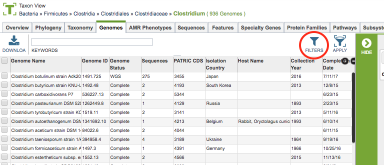
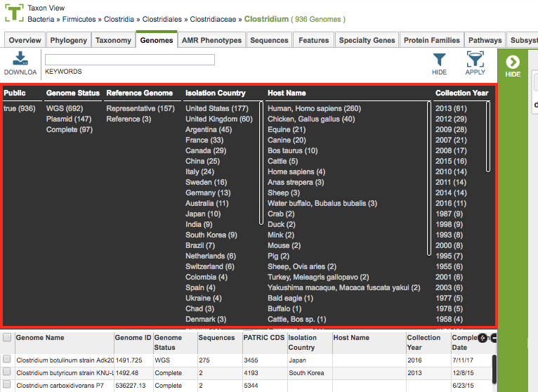
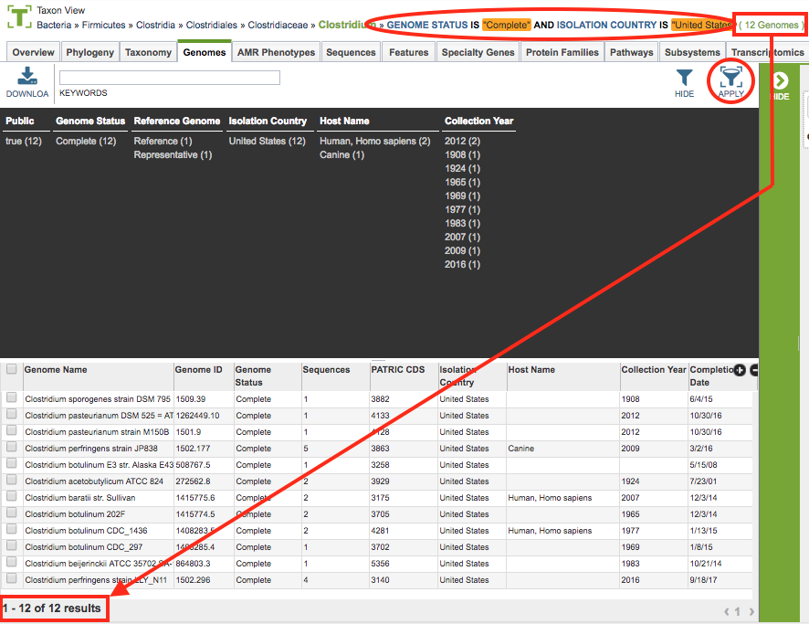

# PATRIC Tables and Filters

## Overview
Interactive Tables are used throughout the PATRIC website to present and provide access to collections or lists of data items such as genomes, features, protein families, experiment data, interactions, and so on. The tables provide the ability to sort, filter, page through, and search the items in the table.

### See also:
  * [Website Views](./website_views.html)
  * [Selection Action Bar](./action_bar.html)

## Accessing Tables on the PATRIC Website
Tables are used throughout the PATRIC website where lists of data items are presented, for example, in data tabs such as Genomes, Features, Protein Families, Pathways, Transcriptomics, Interactions, etc. The example below shows a PATRIC Table listing a set of genomes in a particular taxon.
 

## Table Tools
PATRIC tables include a variety of tools for accessing, filtering, sorting, and arranging the data in the table.  These are described below.
 

1. **Breadcrumbs** at the top of the page provide summary information regarding what data the table contains including a count of the items in the table.  The breadcrumbs are interactive, so clicking on an item in the breadcrumb resets the table to contain the corresponding items for the selection. For instance, in a Taxon View, clicking a higher taxon level will update the table to contain all of the items (genomes for instance) in that higher level taxon.

2. **Download Button** at the top left of the table will download the entire contents of the table in TXT, CSV, or Excel format.

3. **Keyword Box** at the top left of the table, just to the right of the Download Button, allows filtering the contents of the table based on particular keywords. Clicking the "X" underneath the box will remove the filter.  Entering multiple keywords in the box will filter the table to show only those items which contain *all* of the keywords.

4. **Filters** at the top right of the table provide a detailed filter selection capability, described in more detail in the Filter Tool section below.

5. **Column Headers** across the top of the table provide the category name of the data in that column. Clicking on the column header sorts/resorts the table based on the alphanumeric order of the contents of that column.

6. **Table Body** presents the data in the table.

7. **Results Count** at the bottom left of the table provides the total number of items (rows) of the table and how many are currently being displayed.

8. **Page Count** at the bottom right of the table shows the total number of pages in the table, plus which one is currently being displayed.  Clicking on one of the numbers scrolls the table to that page.

9. **Column Selector** at the top right of the table, below the filter buttons, allows showing/hiding of all columns in the table.  By default, most tables only show a portion of the available columns. Cicking on the (+ -) button of the column selector displays a checklist of all of the available columns for the table.  Checking or unchecking the column name adds or removes (respectively) that column from the table display.

10. **Row Selector** in the left-most column of the table provides checkboxes for selecting items (rows) in the table. The options in the Selection Action Bar and data displayed in the Information Panel (both described below) on the right side of the table are updated based on the rows selected. Clicking the top checkbox in the Column Header row selects/de-selects all of the rows in the table, including those on other pages.

11. **Selection Action Bar** along the right side of the table (vertical green bar) display buttons that provide access to related data or tools to operate on the data corresponding to the selected row(s). See [Select Action Bar](./action_bar.html) for more information.

12. **Information Panel** provides details on the selected item(s).  If a single item (row) is selected, it provides a listing of the column (category) and the corresponding value for that item.  If mutiple items (rows) are selected, it provides a summary of the number of items selected.

### Filter Tool

As with all tables in PATRIC, the Filter Tool is available to narrow the display of the items in the table, shown below:
  

Clicking on the Filters Button at the top right of the table opens the Filter Panel above the table, displaying column names from the table and values for those columns with counts of occurence. This provides a summary view of the contents of the table, shown below.  

Clicking on the filter values narrows the items *displayed* in the table to those matching the chosen filter values. However, the total number of items in the table does not change.  This can be seen by the Results Count on the bottom left of the table and the number at the end of the Breadcrumbs above the table.  Also, the selected filter values are shown beside the Keyword Box above the Filter Panel. The individual filter items can be removed by clicking the "X" underneath the filter value. See noted areas in figure below. 

Clicking the Apply Button removes the non-matching genomes and *resets the scope* in the current View, and so, the table as well, to only those items matching the filter criteria. This can be verified by checking that the number in the Breadcrumbs and in the Results Count are now the same. Also, the Breadcrumbs will be updated to include the Filter criteria that were applied. See noted areas in figure below.

Clicking the Hide button closes the Filter Panel.   More details are available in the [Filter Tool](../other/filter_tool.html) user guide.

