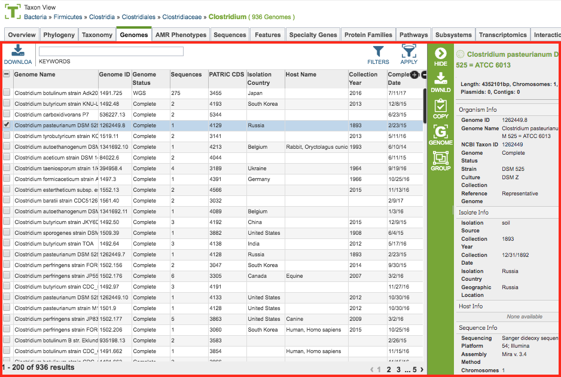
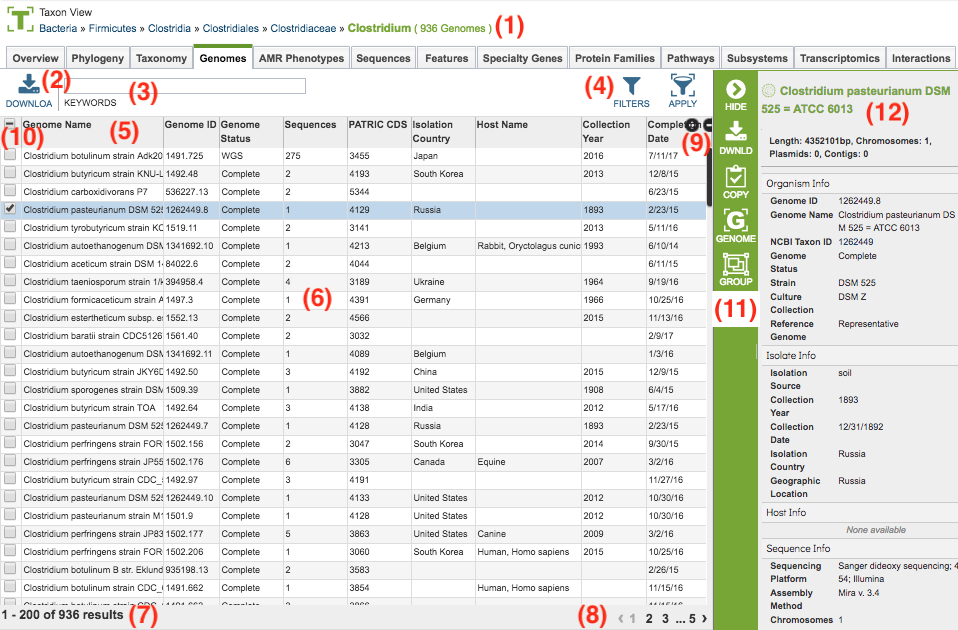

# PATRIC Tables and Filters

## Overview
Interactive Tables are used throughout the PATRIC website to present and provide access to collections or lists of data items such as genomes, features, protein families, experiment data, interactions, and so on. The tables provide the ability to sort, filter, page through, and search the items in the table.

### See also:
  * [Website Views](./website_views.html)
  * [Select Action Bar](./action_bar.html)

## Accessing Tables on the PATRIC Website
Tables are used throughout the PATRIC website where lists of data items are presented, for example, in data tabs such as Genomes, Features, Protein Families, Pathways, Transcriptomics, Interactions, etc. The example below shows a PATRIC Table listing a set of genomes in a particular taxon.
 

## Table Tools
PATRIC tables include a variety of tools for accessing, filtering, sorting, and arranging the data in the table.  These are described below.
 

1. **Breadcrumbs** at the top of the page provide summary information regarding what data the table contains including a count of the items in the table.  The breadcrumbs are interactive, so clicking on an item in the breadcrumb resets the table to contain the corresponding items for the selection. For instance, in a Taxon View, clicking a higher taxon level will update the table to contain all of the items (genomes for instance) in that higher level taxon.

2. **Download Button** at the top left of the page below the tabs will download the entire contents of the table in TXT, CSV, or Excel format.

3. **Keyword Box** at the top left of the page below the tabs and to the right of the Download Button allows filtering the contents of the table based on particular keywords. Clicking the "X" underneath the box will remove the filter.  Entering multiple keywords in the box will filter the table to show only those items which contain *all* of the keywords.

4. 

The Genomes Tab provides a list of all the genomes and associated metadata in corresponding to the selected Taxon View level or for the user-defined Genome Group. From this page, genomes can be sorted, filtered, collected into groups, and downloaded. 

### See also
  * [Genome Annotations](../organisms_taxon/genome_annotations.html)
  * [Genome Metadata](../organisms_taxon/genome_metadata.html)

## Accessing the Genomes Tab on the PATRIC Website
Clicking the Genomes Tab in a Taxon View displays the Genome Table, listing of all of the genomes and associated metadata in corresponding to the selected Taxon View level or for the user-defined Genome Group. 

The genomes in the table include associated metadata information regarding the organism, isolate, host, sequence, phenotype, project, and other.  A complete description of the metadata fields is available in the [Genome Metadata](../organisms_taxon/genome_metadata.html) user guide.

### Genomes Table Tools
Within this table you may do the following:

* **Download** the entire contents of the table in text, CSV, or Excel format by clicking the Download button above the table on the left side.

* **Rearrange and narrow** the list of genomes in the table via sorting (using column headers), keywords (using the Keyword box), and filtering (using the Filters tool).

### Filter Tool

As with all tables in PATRIC, the Filters tool is available to narrow the display of the items in the table, show below:
  

Clicking on the Filters button at the top right of the table opens the Filter Panel above the table, displaying column names from the table and values for those columns with counts of occurence.  Clicking on the filter values narrows the genomes *displayed* in the table to those matching the chosen filter values.  Clicking the Hide button closes the Filter Panel.  Clicking the Apply button removes the non-matching genomes and *resets the scope* in the Taxonomic View to only the genomes matching the filter criteria. More details are available in the [Filter Tool](../other/filter_tool.html) user guide.

### Action buttons

After selecting one or more of the genomes by clicking the checkbox beside the Genomes Name in the table, a set of options becomes available in the vertical green Action Bar on the right side of the table.  These include

* **Hide:** Toggles (hides) the right-hand side Details Pane.
* **Download:**  Downloads the selected items (rows).
* **Copy:** Copies the selected items to the clipboard.
* **Genome:** Loads the Genome View Overview page for the selected genome (if only one genome selected).
* **Genomes:** Reloads the Genomes Table in the Genome List View, listing only the genomes that were selected.
* **Group:** Opens a pop-up window to enable adding the selected genomes to an existing or new group in the private workspace.

More details are available in the [Action Buttons](../other/action_buttons.html) user guide.
