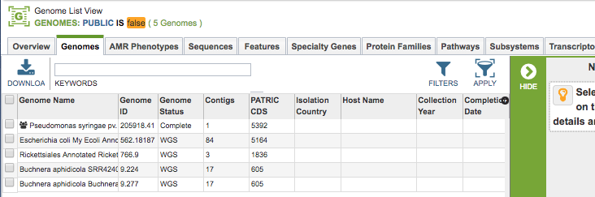

# Genome Sharing

## Overview
It is possible to share a genome annoted using the PATRIC Genome Annotation Service with specified other registered users. This allows these other users to interact with the genome in the PATRIC system in the same way as the user who originally annotated the genome.

### See also:
  * [Genome Annotation Service](../services/genome_annotation_service.html)
  * [Genomes Tab](../organisms_taxon/genomes.html)
  * [Genome Overview Tab](../organisms_genome/overview.html)

## Sharing Genomes on the PATRIC website

When logged in, clicking on the "My Genomes" option in the Workspaces top menu displays the list of genomes that have been annotated using the Genome Annotation Service. 

Selecting one or more of the genomes in the table enables the "Share" button in the vertical green Action Bar on the right side of the table.

Clicking the Share button opens a dialog box for selecting other users with whom to share the genome.

