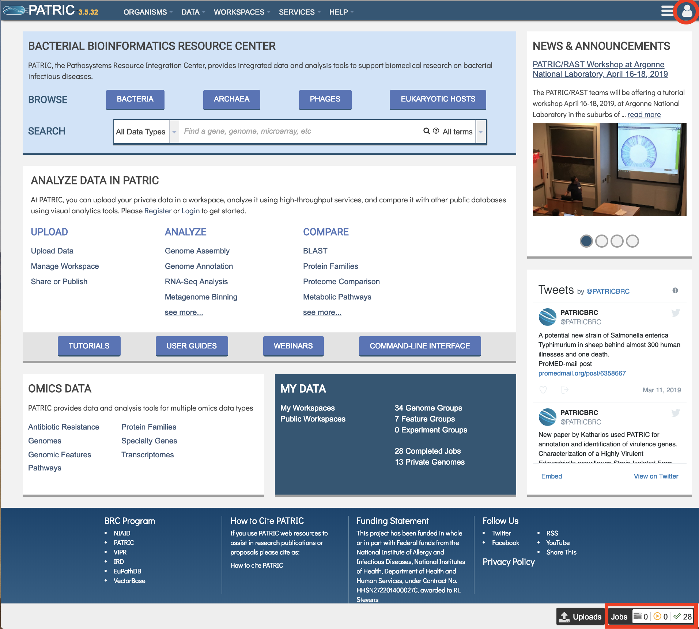
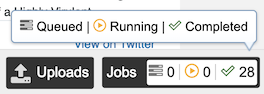
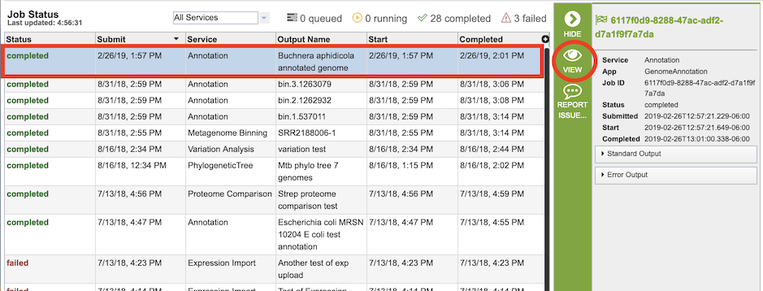

# PATRIC Jobs

## Overview
For most PATRIC services, when the service starts, it creates a computational "job" that runs on back-end high-performance computers which perform the analysis and return the results back to the user via the website or command line interface. The reason for this is that many services, such as Genome Annotation and Genome Assembly, require a significant amount of computational power and time to complete. The job display provides information on the status of the computation: queued, running, completed, or failed. 

### See also:
  * [Services and Tools](../services/services_tab.html.html)
  * [Private Workspace](../workspaces/workspace.html)

## Accessing Job Status Information and Results in the PATRIC Website
If a user is logged in, a small Jobs Indicator box is always displayed at the bottom right of the PATRIC website.  

The Jobs Indicator box provides a compact view of the status of current and prior jobs.

Clicking the Jobs Indicator box displays the Job Status page.  

This page provides a list of all submitted job and additional infomration, including

* **Status** - the current status of the job; either queued, running, completed, or failed.
* **Submit** - the date and time the job was submitted
* **Service** - the name of the PATRIC Service that started the job (e.g., Assembly, Annotation)
* **Output Name** - The name provided by the user to identify the result, displayed in the workspace when the job has completed.
* **Start** - the date and time the job started running.  This will likely be different than the submit time due to queues in the high-performance computers that run the analysis.
* **Completed** - the date and time the job completed, or failed.

