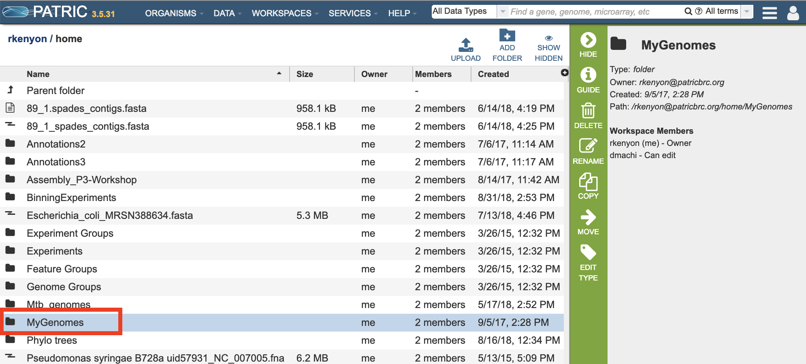
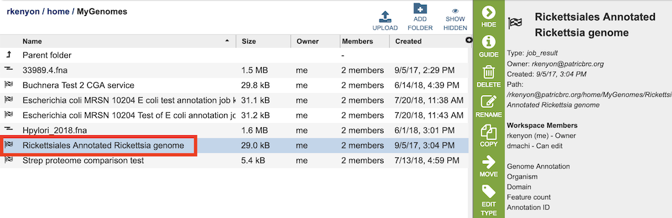

# Private Genomes

## Overview
PATRIC allows users to have their own private genomes stored in the workspace and also available integrated with the rest of the PATRIC public genome data to enable comparative analysis.

### See also:
  * [Genome Annotation Service](../services/genome_annotation_service.html)
  * [Genome Annotation Service Tutorial](https://docs.patricbrc.org/tutorial/genome_annotation/annotation.html)
  * [Private Workspace](../workspaces/workspace.html)
  * [Genomes Tab](../organisms_taxon/genomes.html)
  * [Genome Overview Tab](../organisms_genome/overview.html)

## Creating and Accessing Private Genomes on the PATRIC Website
A private genome is automatically created as a result of running the Genome Annotation Service, and will appear by default in the MyGenomes folder. A different folder can be selected from the input form if desired before running the service. 

Once the genome annotation has completed, the results can be accessed by double-clicking the MyGenomes (or other chosen) folder, which will display a list of the job results.

The results page will consist of a header describing the genome annotation job and a list of output files, as shown below.

5. The first file is *GenomeReport.html*, which is described in [Analyzing Genome Quality](/tutorial/genome_quality_report/genome_quality_report.html).
This file contains a link to the genome's pages in the PATRIC Genome Browser as well as
information about the general quality of the genome. The remaining files shown are as
follows.

*   **contigs.fasta** contains the assembled contigs of the genome in DNA FASTA format.
*   **embl** contains an EMBL dump of the annotated genome.
*   **feature_dna.fasta** contains all the feature sequences of the genome in DNA FASTA format.
*   **feature_protein.fasta** contains all the protein sequences of the genome in protein
    FASTA format.
*   **features.txt** is a tab-delimited text file listing all the features of the genome.
    For each feature, it contains the PATRIC ID, the location string, the feature type,
    the functional assignment, any alternated IDs found, and (for protein-coding genes)
    the protein MD5 checksum.
*   **gb** contains the annotated genome in GENBANK format.
*   **genome** contains a special "Genome Typed Object (GTO)" JSON-format file that encapsulates all the data from the annotated genome. See [Extracting and Mining Genome Typed Objects](https://docs.patricbrc.org/cli_tutorial/cli_getting_started.html#extracting-and-mining-genome-typed-objects-gtos) for more information.
*   **gff** lists all the features of the genome in General Feature Format.

## Using Private Genomes in the PATRIC Website

## Genome Sharing
It is possible to share a genome annoted using the PATRIC Genome Annotation Service with specified other registered users. This allows these other users to interact with the genome in the PATRIC system in the same way as the user who originally annotated the genome.

## Sharing Genomes on the PATRIC website

When logged in, clicking on the "My Genomes" option in the Workspaces top menu displays the list of genomes that have been annotated using the Genome Annotation Service. 

Selecting one or more of the genomes in the table enables the "Share" button in the vertical green Action Bar on the right side of the table.

Clicking the Share button opens a dialog box for selecting other users with whom to share the genome.

