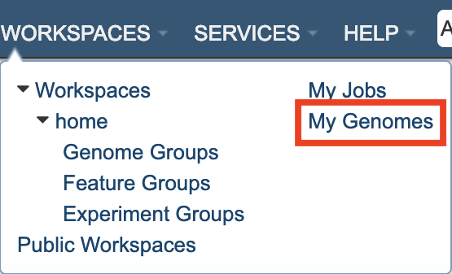
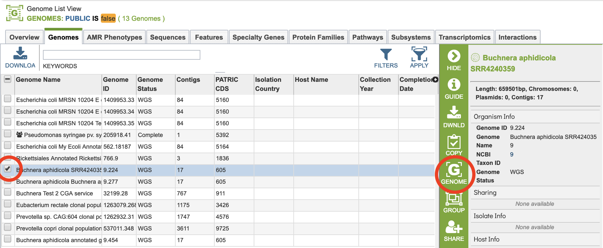
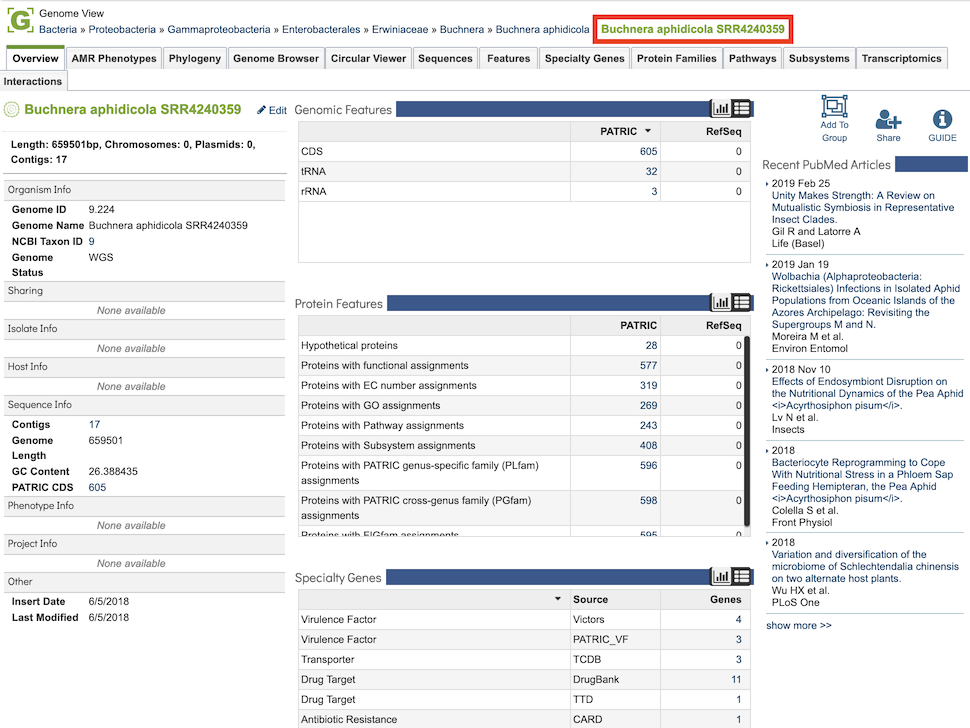
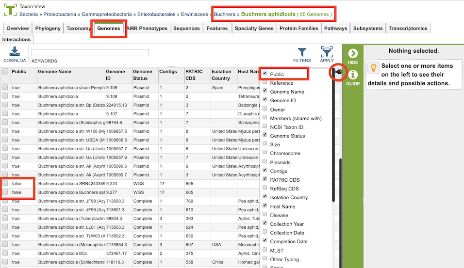
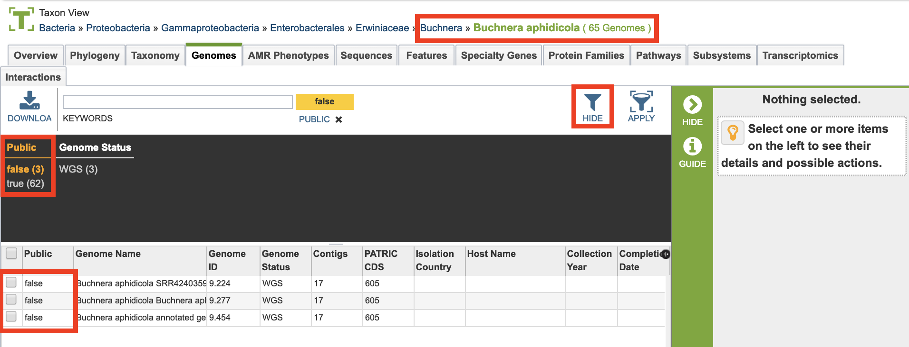
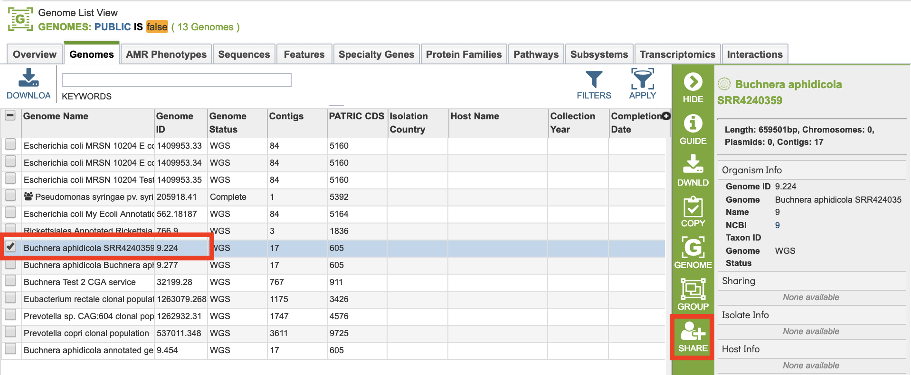

# Private Genomes

## Overview
PATRIC allows users to have their own private genomes stored in the workspace and also available integrated with the rest of the PATRIC public genome data to enable comparative analysis.

### See also:
  * [Genome Annotation Service](../services/genome_annotation_service.html)
  * [Genome Annotation Service User Guide](https://docs.patricbrc.org//user_guides/services/genome_annotation_service.html)
  * [Genome Annotation Service Tutorial](https://docs.patricbrc.org/tutorial/genome_annotation/annotation.html)
  * [Private Workspace](../workspaces/workspace.html)
  * [Genomes Tab](../organisms_taxon/genomes.html)
  * [Genome Overview Tab](../organisms_genome/overview.html)

## Creating Private Genomes on the PATRIC Website
A private genome is automatically created as a result of running the Genome Annotation Service. See the [Genome Annotation Service User Guide](https://docs.patricbrc.org//user_guides/services/genome_annotation_service.html) for details.

## Accessing and Using Private Genomes in the PATRIC Website
Upon successful completion of an annotation job, the resulting annotated genome is integrated into the other genome data in PATRIC, but is only viewable by the owner (submitter) of the annotation job. This integration allows use of all the PATRIC genome display and analysis tools, including comparisons with other genomes in PATRIC.

### Directly Accessing Private Genomes

All private genomes can be accessed together by clicking the My Genomes option from the Workspaces top menu item.

This will display the Genomes Tab with a table containing all of the user's private genomes.

Private genomes can be used like any other genome in PATRIC. Selecting one of the genomes and clicking the Genome button in the right-hand vertical green Action Bar will display the Genome Overview for that genome.

### Accessing Private Genomes in the Context of Other PATRIC Genomes

As described above, private genomes are integrated with public genomes in PATRIC, but are only accessible and viewable by the owner of the genome. Private genomes will be displayed whenever the context (scope) of the view includes the genome, such as in the taxonimic level. Private genomes are denoted by a **"false"** in the *Public* metadata field (columnn) for that genome, which can be seen by adding the field to the table display by clicking the **"+"** sign in the top right corner of the table, shown below.

The Filters option in the Genomes Tab allows quick access to private genomes in the current context, shown below.

From the Genomes Tab, Private and public genomes can be grouped together for further comparative tools and services, such as Variation Analysis, Phylogenetic Tree, Genome Alignment, Protein Family Sorter, and Proteome Comparison. 

## Genome Sharing
It is possible to share a genome annoted using the PATRIC Genome Annotation Service with specified other registered PATRIC users. This allows these other users to interact with the genome in the PATRIC system in the same way as the user who originally annotated the genome. Selecting one or more of the genomes in the table enables the "Share" button in the vertical green Action Bar on the right side of the table. Clicking the Share button opens a dialog box for selecting other users with whom to share the genome.

