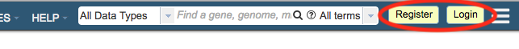
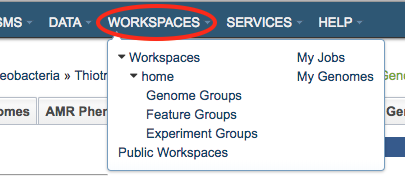
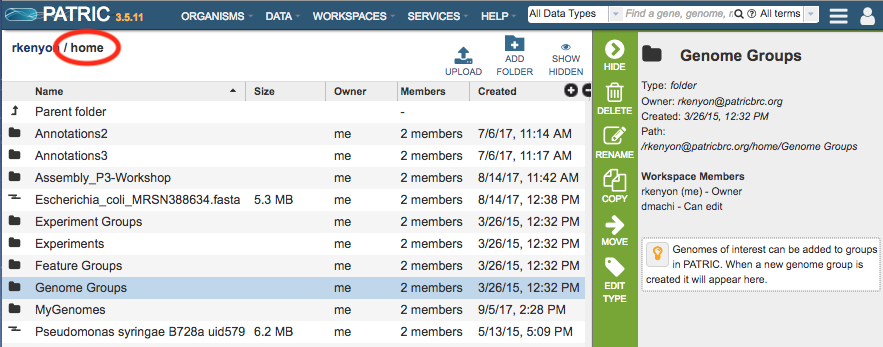
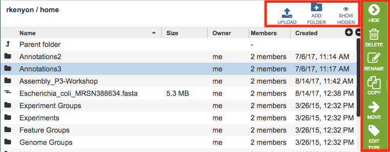
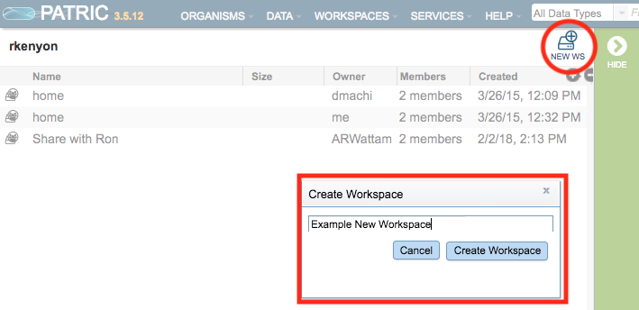
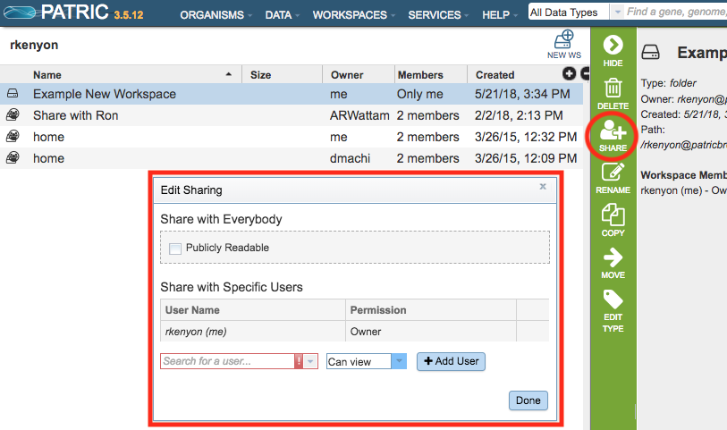
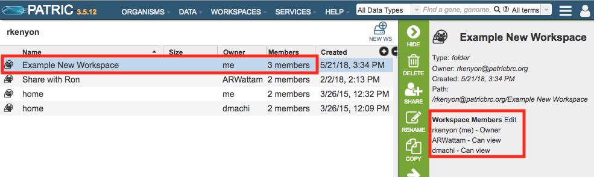
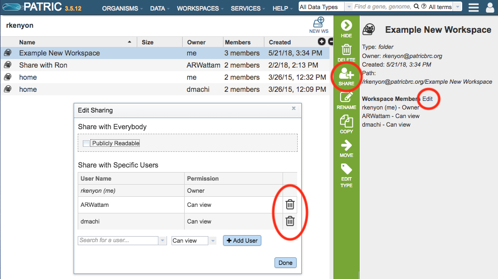

# PATRIC Private Workspace

## Overview
The PATRIC Workspace provides a private area in the website for uploading data, running analysis services on the data, storing the analysis results, and managing groups of data created within the PATRIC website.

### See also:
  * [Groups](../workspaces/groups.html)
  * [Data Upload](../workspaces/data_upload.html)
  * [Registration](../registration.html)
  * [Services and Tools](../services_tab.html)

## Accessing the Private Workspace on the PATRIC Website
Registration is required to use the PATRIC private Workspace. The registration link is at the top right corner of the PATRIC website. If you have already registered, clicking the Login button beside the registration link will display the Login page. 

After logging in, the Workspaces option in the top Menu Bar will become populated with the available workspaces for the logged-in user. 

The default workspace is called "home," which is the top level workspace containing all the files, folders, and job results for the logged in user. Additional shared workspaces may also be available (see Shared Workspaces below).

The table in the workspace lists the Names of folders and files, their Size (files only), the Owner ("me" unless the file or folder was shared by another user), other Members (users) with whom the workspace is shared, and when the file or folder was Created. Double-clicking a folder opens it and displays the contents. Double-clicking the "Parent Folder" at the top of the list moves back up the folder hierarchy and displays contents of the higher level folder. 

## Workspace Tools
Generally, within the Workspace, you can Upload files, Add Folders, and Show Hidden files and folders. Each of these is described below.

### Upload
See [Data Upload](../data_upload.html) for details.

### Add Folder
Initially, the home Workspace is pre-populated with several folders that correspond to common PATRIC data types and are the default locations for data of those type, listed below. Additional custom folders can be created using the Add Folder button at the top right of the workspace table.

* Experiment Groups
* Experiments
* Feature Groups
* Genome Groups

### Show Hidden
When running jobs in PATRIC, some ancillary files are stored in hidden folders to simplify the display. In most cases, access to these files is not needed. However, in some cases, such as annotating contig files from an assembly job, access to the hidden contig files is needed. The Show Hidden button at the top left of the Workspace table will show the hidden files. Clicking the button again (now labeled "Hide Hidden") will hide the files again.

### Action buttons

After selecting one or more of files or folders in the Workspace, a set of options becomes available in the vertical green Action Bar on the right side of the table.  These include

* **Hide:** Toggles (hides) the right-hand side Details Pane.
* **Download:** Downloads the selected item.
* **Delete:** Deletes the selected items (rows).
* **Rename:** Allows renaming the selected item.
* **Copy:** Creates copies the selected items and allows the copies to be put into another folder in the Workspace.
* **Move:** Allows moving of the selected item(s) into another folder in the Workspace.
* **Edit Type:** Allows changing the data type of the selected item. This will change how the Workspace interprets the item. This feature is generally only used when uploading a new data file into the Workspace.  Options include
  * unspecified (default)
  * contigs
  * nwk (Newick file)
  * reads (sequence)
  * diffexp_input_data (expression data)
  * diffexp_input_metadata (metadata for expression data)
  
## Creating and Sharing Workspaces

### Create New Workspace
Registered PATRIC users can create new workspaces and share them with other registered users, if desired. Upon logging in, the default workspace shown is "home." Clicking "Parent folder" at the top of the table in the home directory will display the root directory, which corresponds to the user name. 

Within the root directory, new workspaces can be created.  Clicking the Create Workspace button at the top right of the workspace table will open the Create Workspace dialog box which asks for a name for the new workspace:

### Share Workspace
This new workspace (or any other workspace) can be shared with other registered users. This means that any user with which the workspace is shared will have access to the contents of that workspace when they log in. Sharing is accomplished by selecting the workspace name and clicking the "Share Folder" button on the vertical green Action Bar on the right side. This will open the Edit Sharing dialog box to allow sharing with a single or multiple other registered users, with view-only or edit privileges. The workspace can also be made "Publicly Readable" which makes it accessible by any registered user. : 

Once the workspace has been shared, the row in the workspace will list the number of "Members" in the workspace (number of registered users with access to the workspace). Clicking on the workspace name will list the registered users with access to the workspace. 

### Removing Sharing from Workspace
Sharing of the workspace can be removed by selecting the workspace name, clicking the Share Folder button in the Action Bar, or by clicking the "Edit" link beside the "Workspace Members" in the Information Panel on the right side and then clicking the "trashcan" icon beside the user's name.

