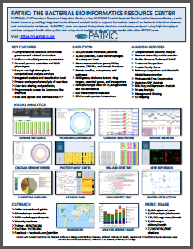

# What is PATRIC?

PATRIC is the ***Bacterial Bioinformatics Resource Center***, an information system designed to support the biomedical research community’s work on bacterial infectious diseases via integration of vital pathogen information with rich data and analysis tools. PATRIC sharpens and hones the scope of available bacterial phylogenomic data from numerous sources specifically for the bacterial research community, in order to save biologists time and effort when conducting comparative analyses. The freely available PATRIC platform provides an interface for biologists to discover data and information and conduct comprehensive comparative genomics and other analyses in a one-stop shop. PATRIC is a NIH/NIAID-funded project of the University of Chicago with subcontract to the Biocomplexity Institute and Initiative of the University of Virginia.

## What PATRIC Offers

* [**Comprehensive Collection of Consistently Annotated Genomes**](../user_guides/organisms_taxon/genome_annotations.html) across all sequenced bacterial species from GenBank and other sources via RASTtk, a highly cited automated prokaryotic annotation system.
* [**Rich Genome Metadata**](../user_guides/organisms_taxon/genome_metadata.html) parsed from a variety of sources in over 60 fields such as, isolation source, geographic location, year of isolation, host and/or environment, antimicrobial resistance (AMR) phenotype, among others.
* [**Data Integration Across Sources, Data Types, Molecular Entities, and Organisms**](../user_guides/organisms_tab.html). Data types include genomics, transcriptomics, protein-protein interactions, 3D protein structures, sequence typing data, and metadata, and are summarized and organized at various taxon, genome, and gene levels.
* [**Suite of High-Throughput Computational Analysis Services**](../user_guides/services_tab.html) including Comprehensive Genome Analysis, Genome Assembly, Genome Annotation, Similar Genome Finder, Proteome Comparison, Protein Family Sorter, Pathway Comparison, Metabolic Model Reconstruction, Phylogenetic Tree Construction, Variation/SNP Analysis, RNA-Seq Analysis, Differential Expression Analysis, TN-Seq Analysis, Metagenomic Binning, and others.
* [**Command-Line Interface**](./cli_tutorial/) for programmatic access to PATRIC data and analysis services.
* [**Personal Private Workspace**](../user_guides/workspace_groups_upload.html) to permanently save groups of genomic data, gene associations, and uploaded private data. Both private and public data can be analyzed together using PATRIC analysis tools. Data can be shared with other registered PATRIC users.

## PATRIC Brochure

[Click here to view brochure](../_static/website/patric-flyer-2018.pdf)

## About the University of Chicago Department of Computer Science
The <a href="https://www.cs.uchicago.edu/" target="_blank">University of Chicago Department of Computer Science</a> (CS) is at the core of the university’s computing and data science activities. Founded in 1983, UChicago CS established itself as one of the world’s leading departments for theoretical computer science research, and has built upon that foundation in the 21st century by expanding into computer systems, cybersecurity, machine learning and artificial intelligence, human-computer interaction, and other areas at the frontier of computation and technology. UChicago CS provides a growing set of options for undergraduate, masters, and PhD students, and benefits from the University of Chicago’s excellence across the spectrum of sciences, policy, business, and medicine to form innovative and unique collaborations. In Fall 2018, UChicago CS moved into a new, state-of-the-art research and teaching facility in the John Crerar Library building.

## About the Biocomplexity Institute and Initiative of the University of Virginia
The <a href="https://biocomplexity.dev8.uvaits.virginia.edu/" target="_blank">Biocomplexity Institute and Initiative of the University of Virginia</a> (BII) integrates scientific research – from genetic sequencing to policy analysis – to tackle the complex task of understanding massively interacting systems and predict solutions to issues impacting human health, well-being, and habitat. As pioneers in biocomplexity, BII understands that interactions at the micro level can produce significant effects on the macro scale. BII collaborates across many disciplines to discover connections between health, information networks, security and infrastructure. The foundation of BII's methodology lies in information biology; the synthesis of mathematics, computation, informatics, and biology. BII approaches complex problem solving by assembling teams of experts in a variety of fields to work together to create solutions that challenge the very fields in which the teams operate.
