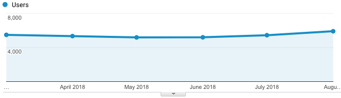

# PATRIC Metrics
PATRIC monitors website traffic, analysis jobs, citations, publications, workshops, and other metrics to quantitatively measure usage of the resource and identify trends. Summaries of these key metrics are provided below. 

## Website Traffic

### Pageviews
6-month total: **809,785**   

Last month: **118,781**

### Sessions
6-month total: **89,618**   

Last month: **15,334** 

### Unique Users
6-month total: **27,454**   

Last month: **5,905**

## Analysis Service Jobs
6-month total: **33,791**   

Last month: **5,331**

## Cumulative Metrics

### Citations and Publications

[Publications that cite PATRIC/RAST:](https://scholar.google.com/citations?user=Ov91kMAAAAAJ&hl=en&authuser=1) **>7,900**

[PATRIC Publications:](https://patricbrc.org/webpage/website/publications.html) **77**

### PATRIC Workshops

[PATRIC Workshops:](https://patricbrc.org/webpage/website/workshops.html) **66**

[Total number of participants:](https://patricbrc.org/webpage/website/workshops.html) **>1900**

[Workshop locations:](https://patricbrc.org/webpage/website/workshops.html)

