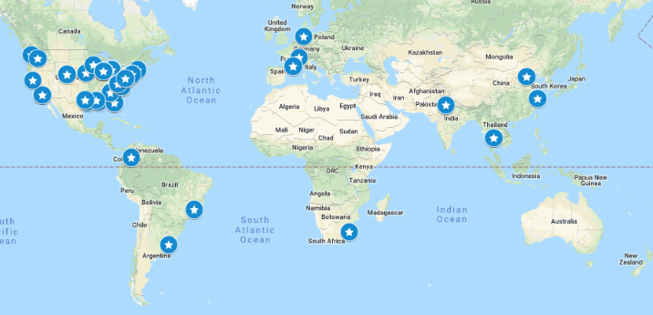

PATRIC Workshops
================
PATRIC provides workshops to give hands-on instruction in the use of PATRIC analysis tools and website features.  Workshops can be customized to focus on particular types of analysis, specific organisms, targeted biological systems, or data sets of interest to the participants. 

PATRIC hosts two open workshops annually, usually at Argonne National Laboratory in the suburbs of Chicago, IL. The PATRIC team can also travel to an onsite location provided that the requesting host can draw at least 20 participants and provide an appropriate training room with fast Internet access. Note that all PATRIC workshops require pre-approval by our sponsor, NIAID, and are limited in number by available funds. International workshops require special permission. To request a workshop, contact us at `help@patricbrc.org  
<mailto:help@patricbrc.org>`_.

The map below shows locations of past workshops and the tables following provide more detailed information on each workshop.

PATRIC 3
--------

+----------------------------------------------+---------------+---------+--------------+
| Institute/Conference                         | Location      | Date    | Participants |
+==============================================+===============+=========+==============+
| University of California, Los Angeles        | Los Angeles,  | Aug '18 |    29        |
|                                              | CA            |         |              |
+----------------------------------------------+---------------+---------+--------------+
| Midwestern University                        | Glendale,     | Aug '18 |    21        |
|                                              | AZ            |         |              |
+----------------------------------------------+---------------+---------+--------------+
| American Type Culture Collection (ATCC)      | Manassas,     | Jul '18 |    34        |
|                                              | VA            |         |              |
+----------------------------------------------+---------------+---------+--------------+
| Virginia Tech Honors Course                  | Blacksburg,   | Jun '18 |    8         |
|                                              | VA            |         |              |
+----------------------------------------------+---------------+---------+--------------+
| ASM Microbe 2018                             | Atlanta, GA   | Jun '18 |    34        |
|                                              |               |         |              |
+----------------------------------------------+---------------+---------+--------------+
| Argonne National Laboratory                  | Argonne, IL   | May '18 |    25        |
|                                              |               |         |              |
+----------------------------------------------+---------------+---------+--------------+
| Baylor College of Medicine                   | Houston, TX   | Mar '18 |    37        |
|                                              |               |         |              |
+----------------------------------------------+---------------+---------+--------------+
| University of California, San Diego          | San Diego, CA | Jan '18 |    30        |
|                                              |               |         |              |
+----------------------------------------------+---------------+---------+--------------+
| Argonne National Laboratory                  | Argonne, IL   | Nov '17 |    34        |
|                                              |               |         |              |
+----------------------------------------------+---------------+---------+--------------+
| Indo-US Workshop on Genomics and             | Faridabad,    | Sep '17 |    25        |
| Bioinformatics                               | India         |         |              |
+----------------------------------------------+---------------+---------+--------------+
| International Conference for Systems Biology | Blacksburg,   | Aug '17 |    8         |
| (ISCB)                                       | VA            |         |              |
+----------------------------------------------+---------------+---------+--------------+
| Argonne National Laboratory                  | Argonne, IL   | Aug '17 |    30        |
|                                              |               |         |              |
+----------------------------------------------+---------------+---------+--------------+
| Max Planck Institute of Marine Microbiology  | Bremen,       | Aug '17 |    25        |
|                                              | Germany       |         |              |
+----------------------------------------------+---------------+---------+--------------+
| Universidad El Bosque                        | Bogotá,       | Aug '17 |    35        |
|                                              | Colombia      |         |              |
+----------------------------------------------+---------------+---------+--------------+
| Siriraj Medical Research Building (SiMR),    | Bangkok,      | Jul '17 |    40        |
| Siriraj Hospital, Mahidol University         | Thailand      |         |              |
+----------------------------------------------+---------------+---------+--------------+
| University of Michigan                       | Ann Arbor, MI | Jul '17 |    25        |
|                                              |               |         |              |
+----------------------------------------------+---------------+---------+--------------+
| ASM Microbe                                  | New Orleans   | Jun '17 |    52        |
|                                              |               |         |              |
+----------------------------------------------+---------------+---------+--------------+
| Virginia Tech Honors Course                  | Blacksburg,   | Jun '17 |    8         |
|                                              | VA            |         |              |
+----------------------------------------------+---------------+---------+--------------+
| GLBIO 2017                                   | Chicago, IL   | May '17 |    20        |
|                                              |               |         |              |
+----------------------------------------------+---------------+---------+--------------+
| Sloan Kettering Cancer Center                | New York, NY  | May '17 |    20        |
|                                              |               |         |              |
+----------------------------------------------+---------------+---------+--------------+
| North Carolina State University              | Raleigh, NC   | Mar '17 |    25        |
|                                              |               |         |              |
+----------------------------------------------+---------------+---------+--------------+
| Argonne National Laboratory                  | Argonne, IL   | Dec '16 |    20        |
|                                              |               |         |              |
+----------------------------------------------+---------------+---------+--------------+
| TWAS-ROESEAP Workshop                        | Bangkok,      | Dec '16 |    40        |
|                                              | Thailand      |         |              |
+----------------------------------------------+---------------+---------+--------------+
| University of Florida                        | Gainesville,  | Oct '16 |    32        |
|                                              | FL            |         |              |
+----------------------------------------------+---------------+---------+--------------+
| Argonne National Laboratory                  | Argonne, IL   | Jul '16 |    20        |
|                                              |               |         |              |
+----------------------------------------------+---------------+---------+--------------+
| Biotechnology Educators Conference           | Blacksburg,   | Jul '16 |    30        |
|                                              | VA            |         |              |
+----------------------------------------------+---------------+---------+--------------+
| ASM Microbe                                  | Boston, MA    | Jun '16 |    64        |
|                                              |               |         |              |
+----------------------------------------------+---------------+---------+--------------+
| Sanford Burnham Prebys Medical Discovery     | San Diego, CA | May '16 |    30        |
| Institute                                    |               |         |              |
+----------------------------------------------+---------------+---------+--------------+
| India International Center                   | New Delhi,    | Jan '16 |    32        |
|                                              | India         |         |              |
+----------------------------------------------+---------------+---------+--------------+
| 2015 Brucellosis Conference                  | Chicago, IL   | Dec '15 |    12        |
|                                              |               |         |              |
+----------------------------------------------+---------------+---------+--------------+
| University of Nebraska Medical Center        | Omaha, NE     | Sep '15 |    15        |
|                                              |               |         |              |
+----------------------------------------------+---------------+---------+--------------+
| Mayo Clinic                                  | Rochester, MN | Aug '15 |    8         |
|                                              |               |         |              |
+----------------------------------------------+---------------+---------+--------------+
| Houston Methodist Research Institute         | Houston, TX   | Aug '15 |    28        |
|                                              |               |         |              |
+----------------------------------------------+---------------+---------+--------------+
| University of Florida                        | Gainesville,  | Jul '15 |    35        |
|                                              | FL            |         |              |
+----------------------------------------------+---------------+---------+--------------+
| San Diego State University                   | San Diego, CA | Jul '15 |    22        |
|                                              |               |         |              |
+----------------------------------------------+---------------+---------+--------------+
| Biotechnology Educators Conference           | Blacksburg,   | Jul '15 |    37        |
|                                              | VA            |         |              |
+----------------------------------------------+---------------+---------+--------------+
| University of Chicago/ANL                    | Argonne, IL   | Jun '15 |    20        |
|                                              |               |         |              |
+----------------------------------------------+---------------+---------+--------------+
| China (3 workshops)                          | Beijing,      | Jun '15 |    130       |
|                                              | Shanghai      |         |              |
+----------------------------------------------+---------------+---------+--------------+
| Virginia Tech Research Center                | Arlington, VA | May '15 |    15        |
|                                              |               |         |              |
+----------------------------------------------+---------------+---------+--------------+
| ISCB-Latin America X-Meeting in              | Belo          | Oct '14 |    40        |
| Bioinformatics1                              | Horizonte,    |         |              |
|                                              | Brazil        |         |              |
+----------------------------------------------+---------------+---------+--------------+

PATRIC 2
--------

+----------------------------------------------+---------------+---------+--------------+
| Institute/Conference                         | Location      | Date    | Participants |
+==============================================+===============+=========+==============+
| Nestle Institute of Health Sciences          | Lausanne,     | May '14 |    25        |
|                                              | Switzerland   |         |              |
+----------------------------------------------+---------------+---------+--------------+
| University of Montpellier                    | Montpellier,  | May '14 |    25        |
|                                              | France        |         |              |
+----------------------------------------------+---------------+---------+--------------+
| University of Chicago                        | Chicago, IL   | May '14 |    33        |
|                                              |               |         |              |
+----------------------------------------------+---------------+---------+--------------+
| Weill Cornell Medical College                | New York, NY  | Feb '14 |    28        |
|                                              |               |         |              |
+----------------------------------------------+---------------+---------+--------------+
| Albert Einstein College of Medicine          | New York, NY  | Feb '14 |    15        |
|                                              |               |         |              |
+----------------------------------------------+---------------+---------+--------------+
| K-RITH                                       | Durban, South | Sep '13 |    30        |
|                                              | Africa        |         |              |
+----------------------------------------------+---------------+---------+--------------+
| Centers for Disease Control (CDC)            | Atlanta, GA   | Jul '13 |    29        |
|                                              |               |         |              |
+----------------------------------------------+---------------+---------+--------------+
| NIH Office of Cyberinfrastructure and        | Bethesda, MD  | Apr '13 |    22        |
| Computational Biology (OCICB)                |               |         |              |
+----------------------------------------------+---------------+---------+--------------+
| Colorado State University (CSU)              | Fort Collins, | Apr '13 |    57        |
|                                              | CO            |         |              |
+----------------------------------------------+---------------+---------+--------------+
| Virginia Bioinformatics Institute (VBI) of   | Blacksburg,   | Mar '13 |    29        |
| Virginia Tech (VT)                           | VA            |         |              |
+----------------------------------------------+---------------+---------+--------------+
| Johns Hopkins University (JHU)               | Baltimore, MD | Mar '13 |    24        |
|                                              |               |         |              |
+----------------------------------------------+---------------+---------+--------------+
| Seattle Biomed                               | Seattle, WA   | Feb '13 |    52        |
|                                              |               |         |              |
+----------------------------------------------+---------------+---------+--------------+
| Pacific Northwest National Laboratory (PNNL) | Richland, WA  | Feb '13 |    12        |
|                                              |               |         |              |
+----------------------------------------------+---------------+---------+--------------+
| Louisiana State University National Hansens  | Baton Rouge,  | Jan '13 |    38        |
| Disease (Leprosy) Clinical Center            | LA            |         |              |
+----------------------------------------------+---------------+---------+--------------+
| Brucellosis 2012 (65th) International        | Chicago, IL   | Dec '12 |    50        |
| Research Conference                          |               |         |              |
+----------------------------------------------+---------------+---------+--------------+
| Global Consortium for Drug-resistant TB      | Web-based     | Nov '12 |    28        |
| Diagnostics                                  | workshop      |         |              |
+----------------------------------------------+---------------+---------+--------------+
| University of North Carolina, Duke           | Durham, NC    | Oct '12 |    50        |
| University, North Carolina State             |               |         |              |
+----------------------------------------------+---------------+---------+--------------+
| Albert Einstein School of Medicine           | Bronx, NY     | Jun '12 |    29        |
|                                              |               |         |              |
+----------------------------------------------+---------------+---------+--------------+
| Tuberculosis Community Annotation Annotation | Arlington, VA | Mar '12 |    20        |
| Project (TBCAP) Jamboree                     |               |         |              |
+----------------------------------------------+---------------+---------+--------------+
| Texas A&M College of Medicine Health Science | College       | Feb '12 |    53        |
| Center                                       | Station, TX   |         |              |
+----------------------------------------------+---------------+---------+--------------+
| VT Genomics, Bioinformatics, and             | Blacksburg,   | Oct '11 |    24        |
| Computational Biology (GBCB) graduate        | VA            |         |              |
| program                                      |               |         |              |
+----------------------------------------------+---------------+---------+--------------+
| UC Davis                                     | Davis, CA     | Apr '11 |    16        |
|                                              |               |         |              |
+----------------------------------------------+---------------+---------+--------------+
| NIAID Office of Cyberinfrastructure and      | Bethesda, MD  | Feb '11 |    16        |
| Computational Biology (OCICB)                |               |         |              |
+----------------------------------------------+---------------+---------+--------------+
| XX Latin-American Meeting on Microbiology    | Montevideo,   | Sep '10 |    50        |
|                                              | Uruguay       |         |              |
+----------------------------------------------+---------------+---------+--------------+
